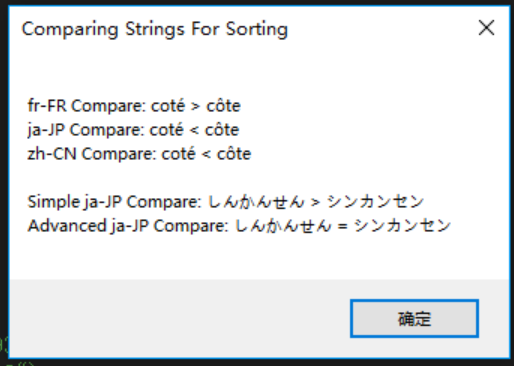
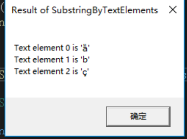
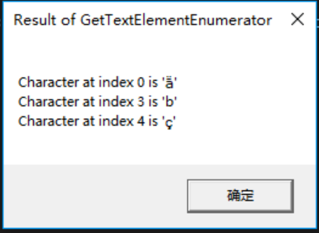
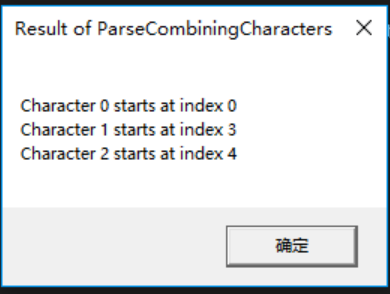
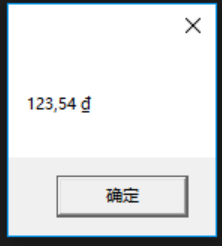
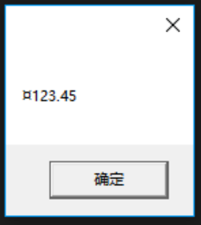

第 14 章 字符、字符串和文本处理

本章内容

* <a href="#14_1">字符</a>
* <a href="#14_2">`System.String`类型</a>
* <a href="#14_3">高效率构造字符串</a>
* <a href="#14_4">获取对象的字符串表示：`ToString`</a>
* <a href="#14_5">解析字符串来获取对象：`Parse`</a>
* <a href="#14_6">编码：字符和字节的相互转换</a>
* <a href="#14_7">安全字符串</a>

本章将解释在 Microsoft .NET Framework 中处理字符和字符串的机制。首先讨论 `System.Char` 结构以及处理字符的多种方式。然后讨论更有用的`System.String`类，它允许处理不可变(immutable)字符串(一经创建，字符串便不能以任何方式修改)。探讨了字符串之后，将介绍如何使用`System.Text.StringBuilder`类高效地动态构造字符串。掌握了字符串的基础知识之后，将讨论如何将对象格式化成字符串，以及如何使用各种编码方法高效率地持久化或传输字符串。最后讨论`System.Security.SecureString`类，它保护密码和信用卡资料等敏感字符串。

## <a name="14_1">14.1 字符</a>

在.NET Framework 中，字符总是表示成 16 位 Unicode 代码值，这简化了国际化应用程序的开发。每个字符都是`System.Char`结构(一个值类型)的实例。`System.Char` 类型很简单，提供了两个公共只读常量字段：`MinValue`(定义成 `‘\0’`)和`MaxValue`(定义成`'\uffff'`)。

为`Char`的实例调用静态`GetUnicodeCategory`方法返回`System.Globalization.UnicodeCategory`枚举类型的一个值，表明该字符是由 Unicode标准定义的控制字符、货币符号、小写字母、大写字母、标点符号、数学符号还是其他字符。

为了简化开发，`Char`类型还提供了几个静态方法，包括`IsDigit`，`IsLetter`，`IsUpper`，`IsLower`，`IsPunctuation`，`IsLetterOrDigit`，`IsControl`，`IsNumber`，`IsSeparator`，`IsSurrogate`，`IsLowSurrogate`，`IsHighSurrogate`和`IsSymbol`等。大多数都在内部调用了`GetUnicodeCategory`，并简单地返回`true`或`false`。注意，所有这些方法要么获取单个字符作为参数，要么获取一个`String`以及目标字符在这个`String`中的索引作为参数。

另外，可调用静态方法 `ToLowerInvariant`或者`ToUpperInvariant`，以忽略语言文化(culture)的方式将字符转换为小写或大写形式。另一个方案是调用`ToLower`和`ToUpper`方法来转换大小写，但转换时会使用与调用线程关联的语言文化信息(方法在内部查询`System.Threading.Thread`类的静态 `CurrentCulture` 属性来获得)。也可向这些方法传递`CultureInfo`类的实例来指定一种语言文化。`ToLower`和`ToUpper`之所以需要语言文化信息，是因为字母的大小写转换时一种依赖于语言文化的操作。比如在土耳其语中，字母U+0069(小写拉丁字母i)转换成大写是 U+0130(大写拉丁字母I，上面加一点)，而其他语言文化的转换结果是 U+0049(大写拉丁字母 I)。

除了这些静态方法，`Char`类型还有自己的实例方法。其中，`Equals`方法在两个`Char`实例代表同一个 16 位 Unicode 码位<sup>①</sup>的前提下返回`true`。`CompareTo`方法(由 `IComparable`和 `IComparable<Char>`接口定义)返回两个`Char`实例的忽略语言文化的比较结果。`ConvertFromUtf32`方法从一个 UTF-32 字符生成包含一个或两个 UTF-16 字符的字符串。`ConvertToUtf32`方法从一对低/高低理项或者字符串生成一个 UTF-32 字符。`ToString`方法返回包含单个字符的一个`String`。与`ToString`相反的是`Parse/TryParse`，它们获取单字符的`String`，`返回该字符的 UTF-16 码位。

> ① 在字符编码术语中，码位或称编码位置，即英文的 code point 或 code position，是组成码空间(或代码页)的数值。例如，ASCII 码包含 128 个码位。——维基百科

最后一个方法是 `GetNumericValue`，它返回字符的数值形式。以下代码演示了这个方法。

```C#
using System;

public static class Program {
    public static void Main() {
        Double d;                           // '\u0033'是”数字3“
        d = Char.GetNumericValue('\u0033'); // 也可直接使用'3'
        Console.WriteLine(d.ToString());    // 显示”3“

        // '\u00bc' 是 ”普通分数四分之一('1/4')“
        d = Char.GetNumericValue('\u00bc');
        Console.WriteLine(d.ToString());    // 显示”0.25“

        // 'A' 是 ”大写拉丁字母 A“
        d = Char.GetNumericValue('A');
        Console.WriteLine(d.ToString());    // 显示”-1“
    }
}
```

最后，可以使用三种技术实现各种数值类型与 `Char` 实例的相互转换。下面按照优先顺序列出这些技术。

* **转型(强制类型转换)**  
  将`Char`转换成数值(比如`Int32`)最简单的办法就是转型。这是三种技术中效率最高的，因为编译器会生成中间语言(IL)指令来执行转换，而且不必调用方法。此外，有的语言(比如 C#)允许指定转换时是使用 checked 还是 unchecked 代码(参见 5.1 节”编程语言的基元类型“)。

* **使用 Convert 类型**  
  `System.Convert` 类型提供了几个静态方法来实现 `Char` 和数值类型的相互转型。所有这些转换都以 checked 方式执行，发现转换将造成数据丢失就抛出 `OverflowException`异常。  

* **使用 IConvertible 接口**  
  `Char` 类型和 FCL 中的所有数值类型都实现了 `IConvertible` 接口。该接口定义了像`ToUInt16` 和 `ToChar` 这样的方法。这种技术效率最差，因为在值类型上调用接口方法`ToUInt16`和`ToChar`这样的方法。这种技术效率最差，因为在值类型上调用接口方法要求对实例进行装箱——`Char`和所有数值类型都是值类型。如果某个类型不能转换(比如 `Char` 转换成 `Boolean`)，或者转换将造成数据丢失，`IConvertible`的方法会抛出`System.InvalidCastException` 异常。注意，许多类型(包括 FCL 的`Char`和数值类型)都将`IConvertible`的方法实现为显式接口成员<sup>①</sup>。这意味着为了调用接口的任何方法，都必须先将实例显式转型为一个`IConvertible`。`IConvertible`的所有方法(`GetTypeCode`除外)都接受对实现了`IFormatProvider`接口的一个对象的引用。如果转换时需要考虑语言文化信息，该参数就很有用。但大多数时候都可以忽略语言文化，为这个参数传递`null`值。

> ① 参见 13.9 节”用显式接口方法实现来增强编译时类型安全性“。

以下代码演示了如何使用这三种技术。

```C#
using System;

public static class Program {
    public static void Main() {
        Char c;
        Int32 n;

        // 通过 C# 转型(强制类型转换)实现数字与字符的相互转换
        c = (Char)65;
        Console.WriteLine(c);               // 显示”A“

        n = (Int32)c;
        Console.WriteLine(n);               // 显示”65“

        c = unchecked((Char)(65536 + 65));
        Console.WriteLine(c);               // 显示"A"

        // 使用 Convert 实现数字与字符的相互转换
        c = Convert.ToChar(65);
        Console.WriteLine(c);               // 显示”A“

        n = Convert.ToInt32(c);
        Console.WriteLine(n);               // 显示”65“

        // 演示 Convert 的范围检查
        try {
            c = Convert.ToChar(70000);      // 对 16 位来说过大
            Console.WriteLine(c);           // 不执行
        }
        catch (OverflowException) {
            Console.WriteLine("Can't convert 70000 to a Char.");
        }

        // 使用 IConvertible 实现数字与字符的相互转换
        c = ((IConvertible)65).ToChar(null);
        Console.WriteLine(c);               // 显示”A“

        n = ((IConvertible)c).ToInt32(null);
        Console.WriteLine(n);               // 显示”65“
    }
}
```

## <a name="14_2">14.2 `System.String` 类型</a>

在任何应用程序中，`System.String`都是用得最多的类型之一。一个 `String` 代表一个不可变(immutable)的顺序字符集。`String`类型直接派生自`Object`，所以是引用类型。因此，`String`对象(它的字符数组)总是存在于堆上，永远不会跑到线程栈<sup>①</sup>。`String`类型还实现了几个接口(`IComparable/IComparable<String>`，`ICloneable`，`IConvertible`，`IEnumerable/IEnumerable<Char>`和`IEquatable<String>`)。

> ① 堆和线程栈的详情请参见 4.4 节 ”运行时的相互关系“

### 14.2.1 构造字符串  

许多编程语言(包括 C#)都将 `String` 视为基元类型——也就是说，编译器允许在源代码中直接使用字面值(literal)字符串。编译器将这些字符串放到模块的元数据中，并在运行时加载和引用它们。

C# 不允许使用 `new` 操作符从字面值字符串构造`String`对象：

```C#
using System;

public static class Program {
    public static void Main() {
        String s = new String("Hi there.");     // 错误
        Console.WriteLine(s);
    }
}
```

相反，必须使用以下简化语法：

```C#
using System;

public static class Program {
    public static void Main() {
        String s = "Hi there.";     // 错误
        Console.WriteLine(s);
    }
}
```

编译代码并检查 IL(使用 ILDasm.exe)，会看到以下内容：

```cmd
.method public hidebysig static void Main() cil managed
{
    .entrypoint
    // Code size 13 (0xd)
    .maxstack 1
    .locals init ([0] string s)
    IL_0000: ldstr "Hi there."
    IL_0005: stloc.0
    IL_0006: ldloc.0
    IL_0007: call void [mscorlib]System.Console::WriteLine(string)
    IL_000c: ret
} // end of method Program::Main
```

用于构造对象新实例的 IL 指令是 `newobj`。但上述 IL 代码中并没有出现`newobj`指令，只有一个特殊`ldstr`(即 load string)指令，它使用从元数据获得的字面值(literal)字符串构造`String`对象。这证明 CLR 实际是用一种特殊方式构造字面值`String`对象。

如果使用不安全的(unsafe)代码，可以从一个`Char*`或`Sbyte*`构造一个`String`。这时要使用C#的`new`操作符，并调用由`String`类型提供的、能接受`Char*`和`Sbyte*`参数的某个构造器。这些构造器将创建`String`对象那个，根据由`Char`实例或有符号(signed)字节构成的一个数组来初始化字符串。其他构造器则不允许接受任何指针参数，用任何托管编程语言写的安全(可验证)代码都能调用它们。<sup>①</sup>

> ① 记住，除非指定了 `/unsafe` 编译器开关，否则 C# 代码必须是安全的或者说具有可验证性，确保代码不会引起安全风险和稳定性风险。详情参见 1.4.2 节”不安全的代码“。 —— 译注

C#提供了一些特殊语法来帮助开发人员在源代码中输入字面值(literal)字符串。对于换行符、回车符和退格符这样的特殊字符，C#采用的是 C/C++ 开发人员熟悉的转义机制：

```C#
// 包含回车符和换行符的字符串
String s = "Hi\r\nthere.";
```

> 重要提示 上例虽然在字符串中硬编码了回车符和换行符，但一般不建议这样做。相反，`System.Environment`类型定义了只读`NewLine`属性。应用程序在 Microsoft Windows 上运行时，该属性返回由回车符和换换行符构成的字符串。例如，如果将公共语言基础结构(CLI)移植到 UNIX 系统，`NewLine`属性将返回由单字符`\n‘构成的字符串。以下才是定义上述字符串的正确方式，它在任何平台上都能正确工作：    

>`String s = "Hi" + Environment.NewLine + "there."`；

可以使用C#的`+`操作符将几个字符串连接成一个。如下所示：

```C#
// 三个字面值(literal)字符串连接成一个字面值字符串
String s = "Hi" + " " + "there.";
```

在上述代码中，由于所有字符串都是字面值，所以 C# 编译器能在编译时连接它们，最终只将一个字符串(即`"Hi there."`)放到模块的元数据中。对非字面值字符串使用`+`操作符，连接则在运行时进行。运行时连接不要使用`+`操作符，因为这样会在堆上创建多个字符串对象，而堆是需要垃圾回收的，对性能有影响。相反，应该使用`System.Text.StringBuilder` 类型(本章稍后详细解释)。

最后，C# 提供了一种特殊的字符串声明方式。采用这种方式，引号之间的所有字符会都被视为字符串的一部分。这种特殊声明称为”逐字字符串“(verbatim string)，通常用于指定文件或目录的路径，或者与正则表达式配合使用。以下代码展示了如何使用和不使用逐字字符串字符(@)来声明同一个字符串：

```C#
// 指定应用程序路径
String file = "C:\\Windows\\System32\\Notepad.exe";

// 使用逐字字符串指定应用程序路径
String file = @"C:\Windows\System32\Notepad.exe";
```

两种写法在程序集的元数据中生成完全一样的字符串，但后者可读性更好。在字符串之前添加@符号使编译器知道这是逐字字符串。编译器会将反斜杠字符视为字面值(literal)而非转义符，使文件路径在源代码中更易读。

了解了如何构造字符串之后，接着探讨可以在 `String` 对象上执行的操作。

### 14.2.2 字符串是不可变的

`String` 对象最重要的一点就是不可变(immutable)。也就是说，字符串一经创建便不能更改，不能变长、变短或修改其中的任何字符。使字符串不可变有几方面的好处。首先，它允许在一个字符串上执行各种操作，而不实际地更改字符串：  

```C#
if (s.ToUpperInvariant().Substring(10, 21).EndsWith("EXE")){
    ...
}
```

`ToUpperInvariant`返回一个新字符串；它没有修改字符串`s`的字符。在`ToUpperInvariant`返回的字符串上执行的`SubString`操作也返回新字符串。然后，`EndsWith`对这个字符串进行检查。代码不会长时间引用由`ToUpperInvariant`和`Substring`创建的两个临时字符串，垃圾回收器会在下次回收它们的内存。如果执行大量字符串操作，会在堆上创建大量`String`对象，造成更频繁的垃圾回收，从而影响应用程序性能。要高效执行大量字符串操作，建议使用`StringBuilder`类。

字符串不可变还意味着在操纵或访问字符串时不会发生线程同步问题。此外，CLR 可通过一个`String`对象共享多个完全一致的`String`内容。这样能减少系统中的字符串数量——从而节省内存——这就是所谓的”字符串留用“(string interning)<sup>①</sup>。

> ① MSDN 文档将 interning 翻译成”拘留“，专门供字符串留用的表称为”拘留池“。本书采用”留用“这一译法。这个技术的详情将在本章后面详细解释。——译注

出于对性能的考虑，`String`类型与 CLR 紧密集成。具体地说，CLR 知道 `String` 类型中定义的字段如何布局，会直接访问这些字段。但为了获得这种性能和直接访问的好处，`String`只能是密封类。换言之，不能把它作为自己类型的基类。如果允许`String`作为基类来定义自己的类型，就能添加自己的字段，而这会破坏 CLR 对于 `String` 类型的各种预设。此外，还可能破坏 CLR 团队因为 `String` 对象”不可变“而做出的各种预设。

### 14.2.3 比较字符串 

”比较“或许是最常见的字符串操作。一般因为两个原因要比较字符串：判断相等性或者排序(通常是为了显示给用户看)。

判断字符串相等性或排序时，强烈建议调用`String`类定义的以下方法之一：

```C#
Boolean Equals(String value, StringComparison comparisonType)
static Boolean Equals(String a, String b, StringComparison comparisonType)

static Int32 Compare(String strA, String strB, StringComparison comparisonType)
static Int32 Compare(string strA, string strB, Boolean ignoreCase, CultureInfo culture)
static Int32 Compare(String strA, String strB, CultureInfo culture, CompareOptions options)
static Int32 Compare(String strA, String strB, CultureInfo culture, CompareOptions options)
static Int32 Compare(String strA, Int32 indexA, String strB, Int32 indexB, Int32 length, StringComparison comparisonType)
static Int32 Compare(String strA, Int32 indexA, String strB, Int32 indexB, Int32 length, CultureInfo culture, CompareOptions options)
static Int32 Compare(String strA, Int32 indexA, String strB, Int32 indexB, Int32 length, Boolean ignoreCase, CultureInfo culture)

Boolean StartsWith(String value, StringComparison comparisonType)
Boolean StartsWith(String value, Boolean ignoreCase, CultureInfo culture)

Boolean EndsWith(String value, StringComparison comparisonType)
Boolean EndsWith(String value, Boolean ignoreCase, CultureInfo culture)
```

排序时应该总是执行区分大小写的比较。原因是假如只是大小写不同的两个字符串被视为相等，那么每次排序都可能按不同顺序排列，用户会感到困惑。

`comparisonType` 参数(上述大多数方法都有)要求获取由 `StringComparison` 枚举类型定义的某个值。该枚举类型的定义如下所示：

```C#
public enum StringComparison {
	CurrentCulture = 0,
	CurrentCultureIgnoreCase = 1,
	InvariantCulture = 2,
	InvariantCultureIgnoreCase = 3,
	Ordinal = 4,
	OrdinalIgnoreCase = 5
}
```

另外，前面有两个方法要求传递一个 `options` 参数，它是 `CompareOptions` 枚举类型定义的值之一：

```C#
[Flags]
public enum CompareOptions {
	None = 0,
	IgnoreCase = 1,
	IgnoreNonSpace = 2,
	IgnoreSymbols = 4,
	IgnoreKanaType = 8,
	IgnoreWidth = 0x00000010,
	Ordinal = 0x40000000,
    OrdinalIgnoreCase = 0x10000000,
	StringSort = 0x20000000
}
```

接受`CompareOptions` 实参的方法要求显式传递语言文化。传递`Ordinal`或`OrdinalIgnoreCase`标志，这些`Compare`方法会忽略指定的语言文化。

许多程序都将字符串用于内部编程目的，比如路径名、文件名、URL、注册表项/值、环境变量、反射、XML标记、XML特性等。这些字符串通常只在程序内部使用，不向用户显示。出于编程目的而比较字符串时，应该总是使用`StringComparison.Ordinal`或者`StringComparison.OrdinalIgnoreCase`。忽略语言文化是字符串比较最快的方式。

另一方面，要以语言文化正确的方式来比较字符串(通常为了向用户显示)，就应该使用`StringComparison.CurrentCulture`或者`StringComparisonCurrentCultureIgnoreCase`。

> 重要提示 `StringComparison.InvariantCulture` 和 `StringComparison.InvariantCultureIgnoreCase`平时最好不要用。虽然这两个值保证比较时的语言文化正确性，但用来比较内部编程所需的字符串，所花的时间远超出序号比较<sup>①</sup>。此外，如果传递`StringComparison.InvariantCulture`(固定语言文化)，其实就是不使用任何具体的语言文化。所以在处理要向用户显示的字符串时，选择它并不恰当。

>>① 传递 `StringComparison.Ordinal` 执行的就是序号比较，也就是不考虑语言文化信息，只比较字符串中的每个`Char`的Unicode码位。——译注

> 重要提示 要在序号比较前更改字符串中的字符的大小写，应该使用`String`的`ToUpperInvariant`或`ToLowerInvariant`方法。强烈建议用`ToUpperInvariant`方法对字符串进行正规化(normalizing)，而不要用`ToLowerInvariant`，因为 Microsoft 对执行大写比较的代码进行了优化。事实上，执行不区分大小写的比较之前，FCL 会自动将字符串正规化为大写形式。之所以要用`ToUpperInvariant`和`ToLowerInvariant`方法，是因为`String`类没有提供`ToUpperOrdinal`和`ToLowerOrdinal`方法。之所以不用`ToUpper`和`ToLower`方法，是因为它们对语言文化敏感。

以语言文化正确的方式比较字符串时，有时需要指定另一种语言文化，而不是使用与调用线程关联的哪一种。这时可用前面列出的`StartsWith`，`EndsWith`和`Compare`方法的重载版本，它们都接受`Boolean`和`CultureInfo`参数。

> 重要提示 除了前面列出之外，`String`类型还为`Equals`，`StartsWith`,`EndsWith`和`Compare`方法定义了其他几个重载版本。但是，Microsoft 建议避免使用这些额外的版本(也就是本书没有列出的版本)。除此之外，`String` 的其他比较方法——`CompareTo`(`IComparable`接口所要求的)、用这些方法和操作符，是因为调用者不显式指出以什么方式执行字符串比较，而你无法从方法名看出默认比较方式。例如，`CompareTo` 默认执行对语言文化敏感的比较，而 `Equals` 执行普通的序号(ordinal)比较。如果总是显式地指出以什么方式执行字符串比较，代码将更容易阅读和维护。

现在重点讲一下如何执行语言文化正确的比较。.NET Framework 使用 `System.Globalization.CultureInfo` 类型表示一个“语言/国家”对(根据RFC 1766标准)。例如，“en-US”代表美国英语，“en-AU”代表澳大利亚英语，而“de-DE”代表德国德语。在CLR中，每个线程都关联了两个特殊属性，每个属性都引用一个`CultureInfo`对象。两个属性的具体描述如下。

* **CurrentUICulture 属性** 该属性获取要向用户显示的资源。它在 GUI 或 Web 窗体应用程序中特别有用，因为它标识了在显示 UI 元素(比如标签和和按钮)时应使用的语言。创建线程时，这个线程属性会被设置成一个默认的 `CultureInfo` 对象，该对象标识了正在运行应用程序的 Windows 版本所用的语言。而这个语言是用 Win32 函数 `GetUserDefaultUILanguage` 来获取的。如果应用程序在 Windows 的 MUI (多语言用户界面，Multilingual User Interface)版本上运行，可通过控制面板的“区域和语言”对话框来修改语言。在非 MUI 版本的 Windows 上，语言由安装的操作系统的本地化版本(或者安装的语言包)决定，而且这个语言不可更改。

* **CurrentCulture 属性** 不合适使用`CurrentUICulture`属性的场合就使用该属性，例如数字和日期格式化、字符串大小写转换以及字符串比较。格式化要同时用到`CultureInfo`对象的“语言”和“国家”部分。创建线程时，这个线程属性被设为一个默认的`CultureInfo`对象，其值通过调用 Win32 函数`GetUserDefaultLCID`来获取。可通过 Windows 控制面板的“区域和语言”对话框来修改这个值。

在许多计算机上，线程的 `CultureUIInfo` 和 `CurrentCulture` 属性都被设为同一个`CultureInfo` 对象。也就是说，它们使用相同的“语言/国家信息”。但也可把它们设为不同对象。例如，在美国运行的一个应用程序可能要用西班牙语来显示它的所有菜单项以及其他 GUI 元素，同时仍然要正确显示美国的货币和日期格式。为此，线程的`CurrentUICulture`属性要引用另一个`CultureInfo`对象，用“en-US”初始化。

`CultureInfo`对象内部的一个字段引用了一个`System.Globalization.CompareInfo`对象，该对象封装了语言文化的字符排序表信息(根据 Unicode 标准的定义)。以下代码演示了序号比较和对语言文化敏感的比较的区别：

```C#
using System;
using System.Globalization;

public static class Program {
    public static void Main() {
        String s1 = "Strasse";
        String s2 = "Straße";
        Boolean eq;

        // Compare 返回非零值 ①
        eq = String.Compare(s1, s2, StringComparison.Ordinal) == 0;
        Console.WriteLine("Ordinal comparison:'{0}' {2} '{1}'", s1, s2, eq ? "==" : "!=");

        // 面向在德国(DE)说德语(de)的人群，
        // 正确地比较字符串
        CultureInfo ci = new CultureInfo("de-DE");

        // Compare 返回零值
        eq = String.Compare(s1, s2, true, ci) == 0;
        Console.WriteLine("Cultural comparison:'{0}' {2} '{1}'", s1, s2, eq ? "==" : "!=");
    }
}
```

> ① `Compare`返回`Int32`值；非零表示不相等，零表示相等。非零和零分别对应`true`和`false`，所以后面的代码将比较结果与`0(false)`进行比较，将`true`或`false`结果赋给`eq`变量。 ——译注

生成并运行上述代码得到以下输出：

```cmd
Ordinal comparison: 'Strasse' != 'Straße'
Cultural comparison: 'Strasse' == 'Straße' 
```

> 注意 `Compare`方法如果执行的不是序号比较就会进行“字符展开”(character expansion)，也就是将一个字符展开成忽视语言文化的多个字符。在前例中，德语 Eszet 字符 “ß” 总是展开成“ss”。类似地，“Æ” 连字总是展开成“AE”。所以在上述代码中，无论传递什么语言文化，对`Compare`的第二个调用始终返回0.

比较字符串以判断相等性或执行排序时，偶尔需要更多的控制。例如，比较日语字符串时就可能有这个需要。额外的控制通过`CultureInfo`对象的`CompareInfo`属性获得。前面说过，`CompareInfo` 对象封装了一种语言文化的字符比较表，每种语言文化只有一个`CompareInfo`对象。

调用`String`的`Compare`方法时，如果调用者指定了语言文化，就使用指定的语言文化，就使用指定的语言文化；如果没有指定，就使用调用线程的`CurrentCulture`属性值。`Compare`方法内部会获取与特定语言文化匹配的`CompareInfo`对象引用，并调用`CompareInfo`对象的`Compare`方法，传递恰当的选项(比如不区分大小写)。自然，如果需要额外的控制，可以自己调用一个特定`CompareInfo`对象的`Compare`方法。

`CompareInfo`类型的`Compare`方法获取来自 `CompareOptions` 枚举类型<sup>①</sup>的一个值作为参数。该枚举类型定义的符号代表一组位标志(bit flag)，对这些位标志执行 OR 运算就能更全面地控制字符串比较。请参考文档获取这些符号的完整描述。

> ① 前面已经展示过 `CompareOptions` 枚举类型。

以下代码演示了语言文化对于字符串排序的重要性，并展示了执行字符串比较的各种方式：

```C#
using System;
using System.Text;
using System.Windows.Forms;
using System.Globalization;
using System.Threading;

public sealed class Program {
    public static void Main() {
        String output = String.Empty;
        String[] symbol = new String[] { "<", "=", ">" };
        Int32 x;
        CultureInfo ci;

        // 以下代码演示了在不同语言文化中，
        // 字符串的比较方式也有所不同
        String s1 = "coté";
        String s2 = "côte";

        // 为法国法语排序字符串
        ci = new CultureInfo("fr-FR");
        x = Math.Sign(ci.CompareInfo.Compare(s1, s2));
        output += String.Format("{0} Compare: {1} {3} {2}",
        ci.Name, s1, s2, symbol[x + 1]);
        output += Environment.NewLine;

        // 为日本日语排序字符串
        ci = new CultureInfo("ja-JP");
        x = Math.Sign(ci.CompareInfo.Compare(s1, s2));
        output += String.Format("{0} Compare: {1} {3} {2}",
        ci.Name, s1, s2, symbol[x + 1]);
        output += Environment.NewLine;

        // 为当前线程的当前语言文化排序字符串
        ci = Thread.CurrentThread.CurrentCulture;
        x = Math.Sign(ci.CompareInfo.Compare(s1, s2));
        output += String.Format("{0} Compare: {1} {3} {2}",
        ci.Name, s1, s2, symbol[x + 1]);
        output += Environment.NewLine + Environment.NewLine;
        
        // 以下代码演示了如何将 CompareInfo.Compare 的
        // 高级选项应用于两个日语字符串。
        // 一个字符串代表用平假名写成的单词“shinkansen”(新干线)；
        // 另一个字符串代表用片假名写成的同一个单词
        s1 = "しんかんせん"; // ("\u3057\u3093\u304B\u3093\u305b\u3093")
        s2 = "シンカンセン"; // ("\u30b7\u30f3\u30ab\u30f3\u30bb\u30f3")
                 
        // 以下是默认比较结果
        ci = new CultureInfo("ja-JP");
        x = Math.Sign(String.Compare(s1, s2, true, ci));
        output += String.Format("Simple {0} Compare: {1} {3} {2}",
        ci.Name, s1, s2, symbol[x + 1]);
        output += Environment.NewLine;
        
        // 以下是忽略日语假名的比较结果
        CompareInfo compareInfo = CompareInfo.GetCompareInfo("ja-JP");
        x = Math.Sign(compareInfo.Compare(s1, s2, CompareOptions.IgnoreKanaType));
        output += String.Format("Advanced {0} Compare: {1} {3} {2}",
        ci.Name, s1, s2, symbol[x + 1]);
        MessageBox.Show(output, "Comparing Strings For Sorting");
    }
}
```

生成并运行以上代码得到如图 14-1 所示的结果。

  
图 14-1 字符串排序结果

> 注意<sup>①</sup> 源代码不要用 ANSI 格式保存，否则日语字符会丢失。要在 Microsoft Visual Studio中保存这个文件，请打开“另存文件为”对话框，单击“保存”按钮右侧的下箭头，选择“编码保存”，并选择“Unicode(UTF-8带签名)-代码页 65001”。Microsoft C# 编译器用这个代码也就能成功解析源代码文件了。

> ① 中文版 Visual Studio 可忽略这个“注意”。——译注

除了`Compare`，`CompareInfo` 类还提供了`IndexOf`，`LastIndexOf`，`IsPrefix`和`IsSuffix`方法。由于所有这些方法都提供了接受`CompareOptions`枚举值的重载版本，所以能提供比`String`类定义的`Compare`，`IndexOf`，`LastIndexOf`，`StartsWith` 和 `EndsWith` 方法更全面的控制。另外，FCL 的`System.StringComparer`类也能执行字符串比较，它适合对大量不同的字符串比较，它适合对大量不同的字符串反复执行同一种比较。

### 14.2.4 字符串留用

如上一节所述，检查字符串相等性是应用程序的常见操作，也是一种可能严重损害性能的操作。执行序号(ordinal)相等性检查时，CLR 快速测试两个字符串是否包含相同数量的字符。答案否定，字符串肯定不相等；答案肯定，字符串则可能相等。然后，CLR 必须比较每个单独的字符才能最终确认。而执行对语言文化敏感的比较时，CLR 必须比较所有单独的字符，因为两个字符串即使长度不同也可能相等。

此外，在内存中复制同一个字符串的多个实例纯属浪费，因为字符串是“不可变”(immutable)的。在内存中只保留字符串的一个实例将显著提升内存的利用率。需要引用字符串的所有变量只需指向单独一个字符串的所有变量只需指向单独一个字符串对象。

如果应用程序经常对字符串进行区分大小写的序号比较，或者事先知道许多字符串对象都有相同的值，就可利用 CLR 的**字符串留用**(string interning)机制来显著提升性能。CLR 初始化时会创建一个内部哈希表。在这个表中，键(key)是字符串，而值(value)是对托管堆中的`String`对象的引用。哈希表最开始是空的(理应如此)。`String`类提供了两个方法，便于你访问这个内部哈希表：

```C#
public static String Intern(String str);
public static String IsInterned(String str);
```

第一个方法 `Intern` 获取一个 `String`， 获得它的哈希码，并在内部哈希表中检查是否有相匹配的。如果存在完全相同的字符串，就返回对现有 `String` 对象的引用。如果不存在完全相同的字符串，就创建字符串的副本，将副本添加到内部哈希表中，返回对该副本的引用。如果应用程序不再保持对原始`String`对象的引用，垃圾回收器就可释放那个字符串的内存。注意垃圾回收器不能释放内部哈希表引用的字符串，因为哈希表正在容纳对它们的引用。
除非卸载 AppDomain 或进程终止，否则内部哈希表引用的 `String` 对象不能被释放。

和 `Intern` 方法一样，`IsInterned` 方法也获取一个 `String`，并在内部哈希表中查找它。如果哈希表中有匹配的字符串，`IsInterned`就返回对这个留用(interned)字符串对象的引用。但如果没有，`IsInterned`会返回`null`，不会将字符串添加到哈希表中。

程序集加载时，CLR 默认留用程序集的元数据中描述的所有字面值(literal)字符串对象的引用。但如果没有，`IsInterned`就返回对这个留用(interned)字符串对象的引用。但如果没有，`IsInterned`会返回`null`，不会将字符串添加到哈希表中。

程序集加载时，CLR 默认留用程序集的元数据中描述的所有字面值(literal)字符串。Microsoft 知道可能因为额外的哈希表查找而显著影响性能，所以现在能禁用此功能。如果程序集用`System.Runtime.CompilerServices.CompilationRelaxationsAttribute` 进行了标记，并指定了 `System.Runtime.CompilerServices.CompilationRelaxations.NoStringInterning`标志值，那么根据 ECMA 规范，CLR 可能选择不留用那个程序集的元数据中定义的所有字符串。注意，为了提升应用程序性能，C#编译器在编译程序时总是指定上述两个特性和标志。

即使程序集指定了这些特性和标志，CLR 也可能选择对字符串进行留用，但不要依赖 CLR 的这个行为。事实上，除非显式调用`String`的`Intern`方法，否则永远都不要以“字符串已留用”为前提来写代码。以下代码演示了字符串留用：

```C#
String s1 = "Hello";
String s2 = "Hello";
Console.WriteLine(Object.ReferenceEquals(s1, s2));  // 显示 'False'

s1 = String.Intern(s1);
s2 = String.Intern(s2);
Console.Writeline(Object.ReferenceEquals(s1, s2)); // 显示 'True'
```

在第一个`ReferenceEquals`方法调用中，`s1`引用堆中的`"Hello"`字符串对象，而`s2`引用堆中的另一个"`Hello`"对象。由于引用不同，所以应该显示`False`。但在 CLR 的 4.5 版本上运行，实际显示的是 `True`。这是由于这个版本的 CLR 选择忽视 C# 编译器插入的特性和标志。程序集加载到 AppDomain 中时，CLR 对字面值(literal)字符串`"Hello"`进行留用，结果是 `s1`和`s2`引用堆中的同一个`“Hello”`字符串。但如前所述，你的代码永远不要依赖这个行为，因为未来版本的 CLR 有可能会重视这些特性和标志，从而不对`“Hello”`字符串进行留用。事实上，使用 NGen.exe 实用程序编译这个程序集的代码，CLR 的 4.5 版本确实会使用这些特性和标志。

在第二个`ReferenceEquals`方法调用之前，`“Hello”`字符串被显式留用，`s1`现在引用已留用的`“Hello”`。然后，通过再次调用`Intern`，`s2`引用和`s1`一样的`“Hello”`字符串。所以第二个`ReferenceEquals`调用保证结果是`True`，无论程序集在编译时是否设置了特性和标志。

现在通过一个例子理解如何利用字符串留用来提升性能并减少内存耗用。以下`NumTimesWordAppearsEquals`方法获取两个参数：一个单词和一个字符串数组。每个数组元素都引用了一个单词。方法统计指定单词在单词列表中出现了多少次并返回计数：

```C#
private static Int32 NumTimesWordAppearsEquals(String word, String[] wordlist) {
    Int32 count = 0;
    for (Int32 wordnum = 0; wordnum < wordlist.Length; wordnum++) {
        if (word.Equals(wordlist[wordnum], StringComparison.Ordinal))
            count++;
    }
    return count;
}
```

这个方法调用了`String`的`Equals`方法，后者在内部比较字符串的各个单独字符，并核实所有字符都匹配。这个比较可能很慢。此外，`wordlist`数组可能有多个元素引用了含有相同字符内容的不同`String`对象。这意味着堆中可能存在多个内容完全相同的字符串，并会在将来进行垃圾回收时幸存下来。

现在看一下这个方法的另一个版本。新版本利用了字符串留用：

```C#
private static Int32 NumTimesWordAppearsIntern(String word, String[] wordlist) {
    // 这个方法假定 wordlist 中的所有数组元素都引用已留用的字符串
    word = String.Intern(word);
    Int32 count = 0;
    for (Int32 wordnum = 0; wordnum < wordlist.Length; wordnum++) {
        if (Object.ReferenceEquals(word, wordlist[wordnum]))
            count++;
    }
    return count;
}
```

这个方法留用了单词，并假定`wordlist` 包含对已留用字符串的引用。首先，假如一个单词在单词列表中多次出现，这个版本有助于节省内存。因为在这个版本中，`worldlist`会包含对堆中同一个`String`对象的多个引用。其次，这个版本更快。因为比较指针就知道指定单词是否在数组中。

虽然`NumTimesWordAppearsIntern`方法本身比`NumTimesWordAppearsEquals`方法快，但在使用`NumTimesWordAppearsIntern`方法时，应用程序的总体性能是可能变慢的。这是因为所有字符串在添加到`wordlist`数组时(这里没有列出具体的代码)都要花时间进行留用。但如果应用程序要为同一个`wordlist`多次调用`NumTimesWordAppearsIntern`，这个方法真的能提升应用程序性能和内存利用率。总之，字符串留用虽然有用，但使用须谨慎。事实上，这正式 C# 编译器默认不想启用字符串留用的原因。<sup>①</sup>

> ① 虽然编译器应用了特性并设置了不进行字符串留用的标志，但 CLR 选择忽视这些设置你也没有办法。 ——译注

### 14.2.5 字符串池

编译源代码时，编译器必须处理每个字面值(literal)字符串，并在托管模块的元数据中嵌入。同一个字符串在源代码中多次出现，把它们都嵌入元数据会使生成的文件无谓地增大。

为了解决这个问题，许多编译器(包括 C#编译器)只在模块的元数据中只将字面值字符串写入一次。引用该字符串的所有代码都被改成引用元数据中的同一个字符串。编译器将单个字符串的多个实例合并成一个实例，能显著减少模块的大小。但这并不是新技术，C/C++ 编译器多年来一直在采用这个技术(Micrisoft 的 C/C++ 编译器称之为“字符串池”)。尽管如此，字符串池仍是提升字符串性能的另一种行之有效的方式，而你应注意到它的存在。

### 14.2.6 检查字符串中的字符和文本元素

虽然字符串比较于排序或测试相等性很有用，但有时只是想检查一下字符串中的字符。`String`类型为此提供了几个属性和方法，包括 `Length`，`Chars`(一个 C# 索引器<sup>②</sup>)，`GetEnumerator`，`ToCharArray`，`Contains`，`IndexOf`，`IndexOfAny`和`LastIndexOfAny`。

> ② 或者说有参属性。 ——译注

`String.Char`实际代表一个 16 位 Unicode 码值，而且该值不一定就等于一个抽象 Unicode 字符。例如，有的抽象 Unicode 字符是两个码值的组合。U+0625(阿拉伯字母 Alef with Hamza below)和 U+0650(Arabic Kasra)字符组合起来就构成了一个抽象字符或者**文本元素**(text element)。

除此之外，有的 Unicode 文本元素要求用两个16 位值表示。第一个称为“高位代理项”(high surrogate)。其中，高位代理项范围在 U+D800 到 U+ DBFF 之间，低位代理项范围在 U+DC00 到 U+DFFF 之间。有了代理项，Unicode 就能表示 100 万个以上不同的字符。

美国和欧洲很少使用代理项，东亚各国则很常用。为了正确处理文本元素，应当使用`System.Globalization.StringInfo`类型。使用这个类型最简单的方式就是构造它的实例，向构造器传递一个字符串。然后可以查询`StringInfo`的`LengthInTextElements`属性来了解字符串中有多少个文本元素。接着就可以调用`StringInfo`的`SubstringByTextElements`方法来提取所有文本元素，或者提取指定数量的连续文本元素。

`StringInfo`类还提供了静态方法`GetTextElementEnumerator`，它返回一个`System.Globalization.TextElementEnumerator`对象，允许枚举字符串中包含的所有抽象 Unicode 字符。最后，可调用`StringInfo` 的静态方法`ParseCombiningCharacters`来返回一个`Int32`数组。从数组长度就能可以字符串包含多少个文本元素。每个数组元素都是一个文本元素的起始码值索引。

以下代码演示了使用 `StringInfo` 类来处理字符串中的文本元素的各种方式：

```C#
using System;
using System.Text;
using System.Globalization;
using System.Windows.Forms;

public sealed class Program {
    public static void Main() {
        // 以下字符串包含组合字符
        String s = "a\u0304\u0308bc\u0327";
        SubstringByTextElements(s);
        EnumTextElements(s);
        EnumTextElementIndexes(s);
    }

    private static void SubstringByTextElements(String s) {
        String output = String.Empty;

        StringInfo si = new StringInfo(s);
        for (Int32 element = 0; element < si.LengthInTextElements; element++) {
            output += String.Format("Text element {0} is '{1}'{2}", element, si.SubstringByTextElements(element, 1), Environment.NewLine);
        }
        MessageBox.Show(output, "Result of SubstringByTextElements");
    }

    private static void EnumTextElements(String s) {
        String output = String.Empty;

        TextElementEnumerator charEnum = StringInfo.GetTextElementEnumerator(s);
        while (charEnum.MoveNext()) {
            output += String.Format("Character at index {0} is '{1}'{2}", charEnum.ElementIndex, charEnum.GetTextElement(), Environment.NewLine);
        }
        MessageBox.Show(output, "Result of GetTextElementEnumerator");
    }

    private static void EnumTextElementIndexes(String s) {
        String output = String.Empty;

        Int32[] textElemIndex = StringInfo.ParseCombiningCharacters(s);
        for (Int32 i = 0; i < textElemIndex.Length; i++) {
            output += String.Format("Character {0} starts at index {1}{2}", i, textElemIndex[i], Environment.NewLine);
        }
        MessageBox.Show(output, "Result of ParseCombiningCharacters");
    }
}
```

编译并运行上述代码，会显示如图 14-2、图 14-3 和 图 14-4 所示的对话框。

  
图 14-2 `SubstringByTextElements`的结果 

  
图 14-3 `GetTextElementEnumerator`的结果  

  
图 14-4 `ParseCombiningCharacters`的结果  

### 14.2.7 其他字符串操作

还可利用`String`类型提供的一些方法来复制整个字符串或者它的一部分。表 14-1 总结了这些方法。

表 14-1 用于复制字符串的方法 
|成员名称|方法类型|说明|
|:---:|:---:|:---:|
|`Clone`|实例|返回对同一个对象(`this`)的引用。能这样做是因为`String`对象不可变(immutable)。该方法实现了 `String` 的 `ICloneable`接口|
|`Copy`|静态|返回指定字符串的新副本。该方法很少用，它的存在只是为了帮助一些需要把字符串当作 token 来对待的应用程序。通常，包含相同字符内容的多个字符串会被“留用”(intern)为单个字符串。该方法创建新字符串对象，确保即时字符串包含相同字符内容，引用(指针)也有所不同|
|`CopyTo`|实例|将字符串中的部分字符复制到一个字符数组中|
|`Substring`|实例|返回代表原始字符串一部分的新字符串|
|`ToString`|实例|返回对同一个对象(`this`)的引用|

除了这些方法，`String`还提供了多个用于处理字符串的静态方法和实例方法，比如`Insert`，`Remove`，`PadLeft`，`Replace`，`Split`，`Join`，`ToLower`，`ToUpper`，`Trim`，`Concat`，`Format`等。使用所有这些方法时都请牢记一点，它们返回的都是新的字符串对象。这是由于字符串是不可变的。一经创建，便不能修改(使用安全代码的话)。

## <a name="14_3">14.3 高效率构造字符串</a>

由于`String`类型代表不可变字符串，所以 FCL 提供了 `System.Text.StringBuilder` 类型对字符串和字符进行高效动态处理，并返回处理好的`String`对象。可将`StringBuilder`想像成创建 `String` 对象的特殊构造器。你的方法一般应获取 `String` 参数而非 `StringBuilder`参数。

从逻辑上说，`StringBuilder`对象包含一个字段，该字段引用了由`Char`结构构成的数组。可利用`StringBuilder`的各个成员来操纵该字符数组，高效率地缩短字符串或更改字符串中的字符。如果字符串变大，超过了事先分配的字符数组大小，`StringBuilder`会自动分配一个新的、更大的数组，复制字符，并开始使用新数组。前一个数组被垃圾回收。

用 `StringBuilder` 对象构造好字符串后，调用`StringBuilder`的`ToString`方法即可将`StringBuilder`的字符数组“转换”成`String`。这样会在堆上新建`String`对象，其中包含调用`ToString`时存在于`StringBuilder`中的字符串。之后可继续处理`StringBuilder`中的字符串。以后可再次调用`ToString`把它转换成另一个`String`对象。

### 14.3.1 构造`StringBuilder`对象

和`String`类不同，CLR 不觉得`StringBuilder`类有什么特别。此外，大多数语言(包括C#)都不将`StringBuilder`类视为基元类型。要像构造其他任何非基元类型那样构造`StringBuilder`对象：  

`StringBuilder sb = new StringBuilder();` 

`StringBuilder`类型提供了许多构造器。每个构造器的职责是分配和初始化由每个`StringBuilder`对象维护的状态。下面解释了`StringBuilder`类的关键概念。

* **最大容量**  
  一个`Int32`值，指定了能放到字符串中的最大字符数。默认值是`Int32.MaxValue`(约 20 亿)。一般不用更改这个值，但有时需要指定较小的最大容量以确保永远不会创建超出特定长度的字符串。构造好之后，这个`StringBuilder`的最大容量就固定下来了，不能再变。
  
* **容量**  
  一个`Int32`值，指定了由`StringBuilder`维护的字符数组的长度。默认为`16`。如果事先知道要在这个`StringBuilder`中放入多少字符，那么构造`StringBuilder`对象时应该自己设置容量。  
  向字符数组追加字符时，`StringBuilder`会检测数组会不会超过设定的容量。如果会，`StringBuilder`会自动倍增容量字段，用新容量来分配新数组，并将原始数组的字符复制到新数组中。随后，原始数组可以被垃圾回收。数组动态扩容会损害性能。要避免就要设置一个合适的初始容量。
  
* **字符数组**  
  一个由`Char` 结构构成的数组，负责维护“字符串”的字符内容。字符数总是小于或等于“容量”和“最大容量”值。可用`StringBuilder`的`Length`属性来获取数组中已经使用的字符数。`Length`总是小于或等于`StringBuilder`的“容量”值。可在构造`StringBuilder`时传递一个`String`来初始化字符数组。不传递字符串，数组刚开始不包含任何字符——也就是说，`Length`属性返回`0`。

### 14.3.2 `StringBuilder`的成员 

和`String`不同，`StringBuilder`代表可变(mutable)字符串。也就是说，`StringBuilder`的大多数成员都能更改字符数组的内容，同时不会造成在托管堆上分配新对象。`StringBuilder`只有以下两种情况才会分配新对象。

* 动态构造字符串，其长度超过了设置的“容量”。
* 调用`StringBuilder`的`ToString`方法。

表 14-2 总结了 `StringBuilder`的成员。

表 14-2 StringBuilder 的成员

|成员名称|成员类型|说明|
|:---:|:---:|:---:|
|`MaxCapacity`|只读属性|返回字符串能容纳的最大字符串(最大容量)|
|`Capacity`|可读/可写属性|获取或设置字符数组的长度(容量)。将容量设得比字符串长度小或者比`MaxCapacity`大将抛出`ArgumentOutOfRangeException`异常|
|`EnsureCapacity`|方法|保证字符数组至少具有指定的长度(容量)。如果传给方法的值大于`StringBuilder`的当前容量，当前容量会自动增大。如果当前容量已大于传给该属性的值，则不发生任何变化|
|`Length`|可读/可写属性|获取或设置“字符串”中的字符数。它可能小于字符数组的当前容量。将这个属性设为`0`，会将`StringBuilder`的内容重置为肯空字符串|
|`ToString`|方法|这个方法的无参版本返回代表`StringBuilder`的字符数组的一个`String`|
|`Chars`|可读/可写索引器属性|获取或设置字符数组指定索引位置的字符。在C#中，这是一个索引器(有参属性)，要用数组语法(`[]`)来访问|
|`Clear`|方法|清除`StringBuilder`对象的内容，等同于把它的`Length`属性设为`0`|
|`Append`|方法|在字符数组末尾追加一个对象；如果必要，数组会进行扩充。使用常规格式和与调用线程关联的语言文化将对象转换成字符串|
|`Insert`|方法|在字符数组中插入一个对象；如果必要，数组会进行扩充。使用常规格式和与调用线程关联的语言文化将对象转换成字符串|
|`AppendFormat`|方法|在字符数组末尾追加指定的零个或多个对象；如有必要，数组会进行扩充。使用调用者提供的格式化和语言文化信息，将这些对象转换成字符串。`AppendFormat`是处理`StringBuilder`对象时最常用的方法之一|
|`AppendLine`|方法|在字符数组末尾追加一个行中止符或者一个带行中止符的字符串；如有必要，会增大数组的容量|
|`Replace`|方法|将字符数组中的一个字符替换成另一个字符，或者将一个字符串替换成另一个字符串|
|`Remove`|方法|从字符数组中删除指定范围的字符|
|`Equals`|方法|只有两个`StringBuilder`对象具有相同最大容量、字符数组容量和字符内容才返回`true`|
|`CopyTo`|方法|将`StringBuilder`的字符内容的一个子集复制到一个`Char`数组中|

使用`StringBuilder`的方法要注意，大多数方法返回的都是对同一个`StringBuilder`对象的引用，所以几个操作能连接到一起完成：

```C#
StringBuilder sb = new StringBuilder();
String s = sb.AppendFormat("{0} {1}", "Jeffrey", "Richter").Replace(' ', '-').Remove(4, 3).ToString();
Console.WriteLine(s);       // 显示"Jeff-Richter"
```

`String`和`StringBuilder`类提供的方法并不完全对应。例如，`String`提供了`ToLower`，`ToUpper`，`EndsWith`，`PadLeft`，`PadRight`,`Trim`等方法；但 `StringBuilder` 类没有提供任何与之对应的方法。另一方面，`StringBuilder`类提供了功能更全面的`Replace`方法，允许替换作为字符串一部分的字符或者子字符串(而不是一定要替换整个字符串)。由于两个类不完全对应，所以有时需要在`String`和`StringBuiler`之间转换以完成特定任务。例如，要构造字符串将所有字符转换成大写，再在其中插入一个子字符串，需要写下面这样的代码：

```C#
// 构造一个 StringBuilder 来执行字符串操作
StringBuilder sb = new StringBuilder();

// 使用 StringBuilder 来执行一些字符串操作
sb.AppendFormat("{0} {1}", "Jeffrey", "Richter");

// 将 StringBuilder 转换成 String，以便将所有字符转换成大写
String s = sb.ToString().ToUpper();

// 清除 StringBuilder (分配新的 Char 数组)
sb.Length = 0;

// 将全部字符大写的 String 加载到 StringBuilder 中，执行其他操作
sb.Append(s).Insert(8, "Marc-");

// 将 StringBuilder 转换回 String
s = sb.ToString();

// 向用户显示 String
Console.WriteLine(s);  // “JEFFREY-Marc-RICHTER”
```

仅仅因为 `StringBuilder`没有提供`String`提供的所有操作就要像这样写代码，显然是不方便的，效率也很低。希望 Microsoft 将来能为`StringBuilder`添加更多的字符串操作，进一步完善这个类。

## <a name="14_4">14.4 获取对象的字符串表示：`ToString`</a>

经常都要获取对象的字符串表示。例如，可能需要向用户显示数值类型(比如 `Byte`，`Int32`和`Single`)或者`DateTime`对象。由于.NET Framework 是面向对象的平台，每个类型都有责任提供代码将实例的值转换成字符串表示。FCL 的设计者为此规划了统一的模式。本节将描述这个模式。

可调用`ToString` 方法获取任何对象的字符串表示。`System.Object`定义了一个`public`、`virtual`、无参的`ToString`方法，所以在任何类型的实例上都能调用该方法。在语义上，`ToString`返回代表对象当前值的字符串，该字符串应根据调用线程当前的语言文化进行格式化。例如，在数字的字符串表示中，应该使用与调用线程的语言文化关联的小数点符号、数字分组符号和其他元素。

`System.Object`实现的`ToString`只是返回对象所属类型的全名。这个值用处不大，但对许多不能提供有意义的字符串的类型来说，这也是一个合理的默认值。例如，一个`FileStream`或`Hashtable`对象的字符串表示应该是什么呢？

任何类型要想提供合理的方式获取对象当前值的字符串表示，就应重写`ToString`方法。FCL 内建的许多核心类型(`Byte`，`Int32`，`UInt64`，`Double`等)都重写了`ToString`，能返回符合语言文化的字符串。在 Visual Studio 调试器中，鼠标移动变量上方会出现一条数据提示(datatip)。提示中的文本正是通过调用对象的`ToString`方法来获取的。所以，定义类时应该总是重写`ToString`方法，以提供良好的调试支持。

### 14.4.1 指定具体的格式和语言文化

无参 `ToString` 方法由两个问题。首先，调用者无法控制字符串的格式。例如，应用程序可能需要将数字格式化成货币、十进制、百分比或者十六禁止字符串。其次，调用者不能方便地选择一种特定语言文化来格式化字符串。相较于客户端代码，服务器端应用程序在第二个问题上尤其麻烦。极少数时候，应用程序需要使用与调用线程不同的语言文化来格式化字符串。为了对字符串格式进行更多的控制，你重写的`ToString`方法应该允许指定具体的格式和语言文化信息。

为了使调用者能选择格式和语言文化，类型应该实现 `System.IFormattable`接口：

```C#
public interface IFormattable {
    String ToString(String format, IFormatProvider formatProvider);
}
```

FCL 的所有基类型(`Byte`，`SByte`，`Int16/UInt16`，`Int32/UInt32`，`Int64/UInt64`，`Single`，`Double`，`Decimal`和`DateTime`)都实现了这个接口。此外，还有一些类型(比如`Guid`)也实现了它。最后，每个枚举类型定义都自动实现`IFormattable`接口，以便从枚举类型的实例获取一个有意义的字符串符号。

`IFormattable`的`ToString`方法获取两个参数。第一个是`format`，这个特殊字符串告诉方法应该如何格式化对象。第二个是`formatProvider`，是实现了`System.IFormatProvider`接口的一个类型的实例。该类型为`ToString`方法提供具体的语言文化信息。稍后还要详细讨论。

实现`IFormattable`接口的`ToString`方法的类型决定哪些格式字符串能被识别。如果传递的格式字符串无法识别，类型应抛出`System.FormatException`异常。

Microsoft 在 FCL 中定义的许多类型都能同时识别几种格式。例如，`DateTime`类型支持用“d”表示短日期，用“D”表示长日期，用“g”表示常规(general)，用“M”表示月/日，用“s”表示可排序(sortable)，用“T”表示长时间，用“u”表示 ISO 8601 格式的协调世界时，用“G”表示常规，用“F”表示标志(flag)，用“D”表示十进制，用“X”表示十六进制。第 15 章“枚举类型和位标志”将详细讨论枚举类型的格式化。

此外，所有内建数值类型都支持用“C”表示货币格式，用“D”表示十进制格式，用“E”表示科学计数法(指数)格式，用“F”表示定点(fix-point)格式，用“G”表示常规格式，用“N”表示数字格式，用“P”表示百分比格式，用“R”表示往返行程(round-trip)格式<sup>①</sup>，用“X”表示十六进制格式。事实上，数值类型还支持 picture 格式字符串<sup>②</sup>，它是考虑到在某些时候，简单的格式字符串可能无法完全满足需求。picture 格式字符串包含一些特殊字符，他们告诉类型的`ToString`方法具体要显示多少个数位、具体在什么放置一个小数分隔符以及具体有多少位小数等。欲知详情，请查阅文档中的“自定义数字格式字符串”主题。

> ① 文档中的“标准数字格式字符串”一节对 R 符号(文档中称为说明符)的解释是：往返行程说明符保证转换为字符串的数值再次被分析为相同的数值。使用此说明符格式化数值时，首先使用常规格式对其进行测试：`Double` 使用 15 位精度， `Single` 使用 7 位精度。如果此值被成功地分析回相同的数值，则使用常规格式说明符对其进行格式化。但是，如果此值未被成功地分析为相同数值，则它这样格式化：`Double` 使用 17 位精度，`Single` 使用9位精度。虽然精度说明符可以附加到往返行程格式说明符，但它将被忽略。使用此说明符时，往返行程优先于精度。此格式仅有浮点型(`Single`和`Double`)支持。——译注

> ② picture 确实可以理解成“图片”。例如，使用 picture 数值格式字符串 `###,###` 可以显示千分位分隔符。换言之，像画图那样指定确切的显示格式。——译注

对于大多数类型，调用 `ToString` 并为格式字符串传递 `null` 值完全等价于调用`ToString`并为格式字符串传递“G”。换言之，对象默认使用“常规格式”对自身进行格式化。实现类型时，要选择自己认为最常用的一种格式：这个格式就是“常规格式”。顺便说一句，无参的`ToString`方法假定调用者希望的是“常规格式”。

理解了格式字符串之后，接着研究一下语言文化的问题。字符串默认使用与调用线程关联的语言文化信息进行格式化。无参`ToString`方法就是这么做的；另外，为`formatProvider`参数传递`null`值，`IFormattable`的`ToString`方法也这么做。

格式化数字(货币、整数、浮点数、百分比、日期和时间)适合应用对语言文化敏感的信息。`Guid`类型的`ToString`方法只返回代表 `GUID` 值的字符串。生成`Guid`的字符串时不必考虑语言文化，因为 `GUID` 只用于编程。

格式化数字时，`ToString`方法检查为`formatProvider`参数传递的值。如果传递`null`，`ToString`读取`System.Globalization.CultureInfo.CurrentCulture`属性来判断与调用线程关联的语言文化。该属性返回`System.Globalization.CultureInfo`类型的一个实例。

利用这个对象，`ToString`会读取它的`NumberFormat`或`DateTimeFormat`属性(具体取决于要格式化数字还是日期/时间)。这两个属性分别返回`System.Globalization.NumberFormatInfo`或`System.Globalization.DateTimeFormatInfo`类型的实例。`NumberFormatInfo`类型定义了`CurrencyDecimalSeparator`，`CurrencySymbol`，`NegativeSign`，`NumberGroupSeparator`和`PercentSymbol`等属性。而`DateTimeFormatInfo`类型定义了`Calendar`，`DateSeparator`，`DayNames`，`LongDatePattern`，`ShortTimePattern`和`TimeSeparator`等属性。`ToString`会在构造并格式化字符串时读取这些属性。

调用`IFormattable`的`ToString`方法可以不传递`null`，而是传递一个对象引用，该对象的类型实现了`IFormatProvider`接口：

```C#
public interface IFormatProvider {
    Object GetFormat(Type formatType);
}
```

`IFormatProvider`接口的基本思路是：当一个类型实现了该接口，就认为该类型的实例能提供对语言文化敏感的格式信息，与调用线程关联的语言文化应被忽略。

FCL 的类型只有少数实现了`IFormatProvider`接口。`System.Globalization.CultureInfo`类型就是其中之一。例如，要为越南地区格式化字符串，就需要构造一个`CultureInfo`对象，并将那个对象作为`ToString`的`formatProvider`参数来传递。以下代码将以越南地区适用的货币格式来获取一个`Decimal`数值的字符串表示：

```C#
Decimal price = 123.54M;
String s = price.ToString("C", new CultureInfo("vi-VN"));
MessageBox.Show(s);
```

生成并运行上述代码，会显示如果 14-5 所示的消息框。

  
图 14-5 数值正确格式化以表示越南货币
 
在内部，`Decimal`的`ToString`方法发现`formatProvider`实参不为`null`，所以会像下面这样调用对象的`GetFormat`方法：

`NumberFormatInfo nfi = (NumberFormatInfo) formatProvider.GetFormat(typeof(NumberFormatInfo));`

`ToString`正是采取这种方式从 `CultureInfo` 对象获取恰当获取恰当的数字格式信息。数值类型(比如 `Decimal`)只请求数字格式信息。但其他类型(如 `DateTime`)可能像下面这样调用 `GetFormat`: 

`DateTimeFormatInfo dtfi = (DateTimeFormatInfo)formatProvider.GetFormat(typeof(DateTimeFormatInfo));`

实际上，由于 `GetFormat` 的参数能标识任何类型，所以该方法非常灵活，能请求任意类型的格式信息。.NET Framework 中的类型在调用 `GetFormat` 时，暂时只会请求数字或日期/时间信息，但未来可能会请求其他格式信息。

顺便说一句，如果对象不针对任何具体的语言文化而格式化，那么为了获取它的字符串表示，应调用 `System.Globalization.CultureInfo` 的静态 `InvariantCulture` 属性，并将返回的对象作为`ToString`的`formatProvider`参数来传递：

```C#
Decimal price = 123.45M;
String s = price.ToString("C", CultureInfo.InvariantCulture);
MessageBox.Show(s);
```

生成并运行上述代码，会出现如果 14-6 所示的消息框。注意，在生成的字符串中，第一个字符是`¤`，即国际通用货币符号(U+00A4)。

  

图 14-6 格式化数值来表示语言文化中性的货币值

用 `InvariantCulture` 格式化的字符串一般都不是向用户显示的。相反，一般将这种字符串保存到数据文件中供将来解析。

FCL 只有 3 个类型实现了`IFormatProvider`接口。第一个是前面解释过的`CultureInfo`。另外两个是`NumberFormatInfo`和`DateTimeFormatInfo`。在`NumberFormatInfo`对象上调用`GetFormat`，方法会检查被请求的类型是不是一个`NumberFormatInfo`。如果是就返回`this`，否则返回`null`。类似地，在`DateTimeFormatInfo`对象上调用`GetFormat`，如果请求的是一个`DateTimeFormatInfo`就返回`this`，否则返回`null`。这两个类型实现`IFormatProvider`接口是为了简化编程。试图获取对象的字符串表示时，调用者通常要指定格式，并使用与调用线程关联的语言文化。因此，经常都要调用`ToString`，为`format`参数传递一个字符串，并为`formatProvider`参数传递`null`。为简化`ToString`调用，许多类型都提供了`ToString`方法的多个重载版本。例如，`Decimal`类型提供了4个不同的`ToString`方法：

```C#
// 这个版本调用 ToString(null, null)
// 含义：采用常规数值格式，采用线程的语言文化信息
public override String ToString();

// 这个版本是 ToString 的真正实现
// 这个版本实现了 IFormattable 的 ToString 方法
// 含义：采用由调用者指定的格式和语言文化信息
public  String ToString(String format, IFormatProvider formatProvider);

// 这个版本简单地调用 ToString(format, null)
// 含义：采用由调用者指定的格式，采用线程的语言文化信息
public String ToString(String format);

// 这个版本简单地调用 ToString(null, formatProvider)
// 这个版本实现了 IConvertible 的 ToString 方法
// 含义：采用常规格式，采用由调用者指定的语言文化信息
public String ToString(IFormatProvider formatProvider);
```

### 14.4.2 将多个对象格式化成一个字符串

到日前为止讲的都是一个单独的类型如何格式化它自己的对象。但有时需要构造由多个已格式化对象构成的字符串。例如，以下字符串由一个日期、一个人名和一个年龄构成：

```C#
String s = String.Format("On {0}, {1} is {2} years old.", new DateTime(2012, 4, 22, 14, 35, 5), "Aidan", 9);
Console.WriteLine(s);
```

生成并运行上述代码，而且“en-US”是线程当前的语言文化，就会看到以下输出：

`On 4/22/2012 2:35:05 PM, Aidan is 9 years old.`

`String`的静态`Format`方法获取一个格式字符串。在格式字符串中，大括号中的数字指定了可供替换的参数。本例的格式字符串告诉`Format`方法将`{0}`替换成格式字符串之后的第一个参数(日期/时间)，将`{1}`替换成格式字符串之后的第二个参数(`“Aidan”`)，将`{2}`替换成格式字符串之后的第三个参数`(9)`。

在内部，`Format`方法会调用每个对象的`ToString`方法来获取对象的字符串表示。返回的字符串依次连接到一起，并返回最终的完整字符串。看起来不错，但它意味着所有对象都要使用它们的常规格式和调用线程的语言文化信息来格式化。

在大括号内指定格式信息，可以更全面地控制对象格式化。例如，以下代码和上例几乎完全一致，只是为可替换参数 0 和 2 添加了格式化信息：

```C#
String s = String.Format("On (0:D), {1} is {2:E} years old.", new DateTime(2012, 4, 22, 14, 35, 5), "Aidan", 9);
Console.WriteLine(s);
```

生成并云心上述代码，同时“en-US”是线程当前的语言文化，会看到以下输出：

`On Sunday, April 22, 2012, Aidan is 9.000000E+000 years old.`

`Format` 方法解析格式字符串时，发现可替换参数 0 应该调用它的`IFormattable` 接口的`ToString`方法，并为该方法的两个参数分别传递`"D"`和` null`。类似地，`Format`会调用可替换的参数 2 的`IFormattable`接口的`ToString`方法，并传递`"E"`和`null`。假如可替换参数 0 和参数 2 的类型没有实现`IFormattable`接口，`Format`会调用从`Object`继承(而且有可能重写)的无参`ToString`方法，并将默认格式附加到最终生成的字符串中。

`String`类提供了静态`Format`方法的几个重载版本。一个版本获取实现了`IFormatProvider`接口的对象，允许使用由调用者指定的语言文化信息来格式化所有可替换参数。显然，这个版本的`Format`会调用每个对象的`IFormattable.ToString`方法，并将传给`Format`的任何`IFormatProvider`对象传给它。

如果使用`StringBuilder`而不是`String`来构造字符串，可以调用`StringBuilder`的`AppendFormat`方法。它的原理与`String`的`Format`方法相似，只是会格式化字符串并将其附加到`StringBuilder`的字符数组中。和`String`的`Format`方法一样，`AppendFormat`也要获取格式字符串，而且也有获取一个`IFormatProvider`的版本。

`Syste.Console`的`Write`和`WriteLine`方法也能获取格式字符串和可替换参数。但`Console`的`Write`和`WriteLine`方法没有重载版本能获取一个`IFormatProvider`。要格式化符合特定语言文化的字符串，必须调用`String`的`Format`方法，首先传递所需的`IFormatProvider`对象，再将结果字符串传给`Console`的`Write`或`WriteLine`方法。但这应该不是一个大问题。正如前文所述，客户端代码极少需要使用有别于调用线程的其他语言文化来格式化字符串。

### 14.4.3 提供定制格式化器

现在应该很清楚了，.NET Framework 的格式化功能旨在提供更大的灵活性和更多的控制。但讨论还没有完。可以定义一个方法，在任何对象需要格式化成字符串的时候由`StringBuilder`的`AppendFormat`方法调用该方法。也就是说，`AppendFormat`不是为每个对象调用`ToString`，而是调用定制的方法，按照我们希望的任何方式格式化部分或全部对象。下面的讨论也适用于`String`的`Format`方法。

下面通过一个例子来解释这个机制。假定需要格式化用户在 Internet 浏览器中查看的 HTML 文本，希望所有`Int32`值都加粗显示。所以，每次将`Int32`值格式化成`String`时，都要用`<B>`和`</B>`标记将字符串包围起来。以下代码演示了要做到这一点是多么容易：

```C#
using System;
using System.Text;
using System.Threading;

public static class Program {
    public static void Main() {
        StringBuilder sb = new StringBuilder();
        sb.AppendFormat(new BoldInt32s(), "{0} {1} {2:M}", "Jeff", 123, DateTime.Now);
        Console.WriteLine(sb);
    }

    internal sealed class BoldInt32s : IFormatProvider, ICustomFormatter {
        public Object GetFormat(Type formatType) {
            if (formatType == typeof(ICustomFormatter)) return this;
            return Thread.CurrentThread.CurrentCulture.GetFormat(formatType);
        }

        public String Format(String format, Object arg, IFormatProvider formatProvider) {
            String s;

            IFormattable formattable = arg as IFormattable;

            if (formattable == null) s = arg.ToString();
            else s = formattable.ToString(format, formatProvider);

            if (arg.GetType() == typeof(Int32))
                return "<B>" + s + "</B>";

            return s;
        }
    }
}
```

编译并运行上述代码，而且“en-US”是线程当前的语言文化，控制台上将显示以下输出(你的日期当然不同):

`Jeff <B>123</B> January 30` 

`Main`构造了一个空白`StringBuilder`，在其中附加了格式化好的字符串。调用`AppendFormat`时，第一个参数是`BoldInt32s`类的实例。该类实现了前面描述的`IFormatProvider`接口，另外还实现了`ICustomFormatter`接口，另外还实现了`ICustomFormatter`接口：

```C#
public interface ICustomFormatter {
    String Format(String foramt, Object arg, IFormatProvider formatProvider);
}
```

任何时候只要`StringBuilder`的`AppendFormat`方法需要获取对象的字符串表示，就会调用这个接口的`Format`方法。可以方法内部通过一些巧妙的操作对字符串格式化进行全面控制。现在深入`AppendFormat`方法内部，看看它具体如何工作。以下伪代码展示了`AppendFormat`的工作方式：

```C#
public StringBuilder AppendFormat(IFormatProvider formatProvider, String format, params Object[] args) {
    // 如果传递了一个 IFormatProvider，
    // 就调查它是否提供了一个 ICustomFormatter 对象 
    ICustomFormatter cf = null;
            
    if (formatProvider != null)
        cf = (ICustomFormatter)formatProvider.GetFormat(typeof(ICustomFormatter));

    // 在 StringBuilder 的字符数组中连续附加
    // 字面值 (literal) 字符 (伪代码未显示) 和可替换参数
    Boolean MoreReplaceableArgumentsToAppend = true;
    while (MoreReplaceableArgumentsToAppend) {
        // argFormat 引用从 format 参数获取的可替换格式字符串
        String argFormat = /* .... */;

        // argObj 引用来自 args 数组参数的对应元素
        Object argObj = /* ... */;

        // argStr 引用要在最终生成的字符串后面附加的格式化好的字符串
        String argStr = null;

        // 如果存在定制格式化器，就让它对传递的实参进行格式化，
        // 就尝试别的操作
        if (cf != null)
            argStr = cf.Format(argFormat, argObj, formatProvider);

        // 如果存在定制格式化器，或者它不对实参进行格式化
        // 就尝试别的操作
        if(argStr == null) {
            // 实参的类型支持通过 IFormattable 接口来实现的
            // 富格式化操作(rich formatting)吗
            IFormattable formattable = argObj as IFormattable;
            if (formattable != null) {
                // 是：向类型的 IFormattable ToString 方法传递
                // 格式字符串和 formatProvider 参数
                argStr = formattable.ToString(argFormat, formatProvider);
            } else {
                // 否： 使用线程的语言文化信息来获取默认格式
                if (argObj != null) argStr = argObj.ToString();
                else argStr = String.Empty;
            }
        }

        // 将 argStr 的字符附加到“字符数组”字段成员
        /* ... */

        // 检查剩余的参数是否需要格式化
        MoreReplaceableArgumentsToAppend = /* ... */;
    }
    return this;
}
```

当`Main`调用`AppendFormat`时，`AppendFormat`会调用我的格式提供器(format provider)的`GetFormat`方法，向它传递`ICustomFormatter`类型。在`BoldInt32s` 类型中定义的`GetFormat`方法发现当前请求了`ICustomFormatter`，所以会返回对它自身的引用，因为它已实现了该接口。调用我的`GetFormat`方法时，如果传递的是其他任何类型，就调用与线程关联的`CultureInfo`对象的`GetFormat`方法。

`AppendFormat`需要格式化一个可替换参数时，会调用`ICustomFormatter`的`Format`方法。在本例中，`AppendFormat`调用由`BoldInt32s`类型定义的`Format`方法。我的这个`Format`方法核实要格式化的对象是否支持通过`IFormattable`接口来实现的富格式化操作。如果对象不支持，就调用简单的、无参的`ToString`方法(从`Object`继承)来格式化对象。如果对象支持`IFormattable`，就调用支持富格式化的`ToString`，向它传递格式字符串和格式提供器。

现在已经有了格式化好的字符串。接着要核实对应的对象是不是一个`Int32`类型；如果是，就将格式化好的字符串放到`<B>`和`</B>`这两个 HTML 标记之间，然后返回新字符串。如果不是，就简单地返回格式化好的字符串，不做进一步处理。

## <a name="14_5">14.5 解析字符串来获取对象：`Parse`</a>

上一节解释了如何获取对象并得到它的字符串表示。本节讨论与之相反的操作，即如何获取字符串并得到它的对象表示。从字符串获得对象，这并不是一个常见的操作，但偶尔也会用到。Microsoft 觉得有必要规划一个正式的机制将字符串解析成对象。

能解析字符串的任何类型都提供了公共静态方法`Parse`。方法获取一个`String` 并返回类型的实例。从某种意义上说，`Parse`扮演了一个工厂(factory)的角色。在 FCL 中，所有数值类型、`DateTime`、`TimeSpan`以及其他一些类型(比如各种 SQL 数据类型)均提供了 `Parse` 方法。

来看看如何将字符串解析成数值类型。所有数值类型(`Byte`，`SByte`，`Int16/UInt16`，`Int32/UInt32`，`Int64/UInt64`，`Single`，`Double`和`Decimal`)都提供了至少一个`Parse`方法。以`Int32`类型的`Parse`方法为例(其他数值类型的`Parse`方法与此相似)：

`public static Int32 Parse(String s, NumberStyles style, IFormatProvider provider);`

从原型就能猜出方法具体如何工作。`String`参数`s`是希望解析成`Int32`对象的一个数字的字符串表示。`System.Globalization.NumberStyles`参数`style`是位标志(bit flag)集合，标识了`Parse`应在字符串查找的字符(也就是字符串 `s` 中允许的样式，有不允许的样式会抛出异常)。如本章前面所述，`IFormatProvider`参数`provider`标识了一个对象，`Parse`方法通过该对象获取语言文化特有的信息。

例如，以下代码造成`Parse`抛出`System.FormatException`异常，因为要解析的字符串包含前导空白字符：

`Int32 x = Int32.Parse(" 123", NumberStyles.None, null);`

要允许`Parse`跳过前导的空白字符，要像下面这样修改`style`参数：

`Int32 x = Int32.Parse(" 123", NumberStyles.AllowLeadingWhite, null);`

请参考文档来完整地了解`NumberStyles`枚举类型定义的位符号和常见组合。

以下代码段展示了如何解析十六进制数：

```C#
Int32 x = Int32.Parse("1A ", NumberStyles.HexNumber, null);
Console.WriteLine(x);       // 显示：“26”
```

这个 `Parse` 方法接受 3 个参数。为简化编程，许多类型都提供了额外的`Parse`重载版本，所以不需要传递如此多的实参。例如，`Int32`提供了`Parse`方法的4个重载版本：

```C#
// 为 style 参数传递 NumberStyles.Integer，
// 并传递线程的语言文化提供者信息
public static Int32 Parse(String s);

// 传递线程的语言文化提供者信息
public static Int32 Parse(String s, NumberStyles style);

// 为 style 参数传递 NumberStyles.Integer
public static Int32 Parse(String s, IFormatProvider provider);

// 以下是刚才展示的版本
public static Int32 Parse(String s, NumberStyles style, IFormatProvider provider);
```

`DateTime`类型也提供了一个`Parse`方法：

`public static DateTime Parse(String s, IFormatProvider provider, DateTimeStyles styles);`

这个方法与数值类型定义的`Parse`方法相似，只是`DateTime`的`Parse`方法获取的是由`System.Globalization.DateTimeStyles`枚举类型(而不是`NumberStyles`枚举类型)定义的位标志集合。参考文档来全面了解`DateTimeStyles`类型定义的位符号和常见组合。

为简化编程，`DateTime`类型提供了`Parse`方法的 3 个重载版本：

```C#
// 传递线程的语言文化的提供者信息
// 并为 style 参数传递 DateTimeStyles.None
public static DateTime Parse(String s);

// 为 style 参数传递 DateTimeStyles.None
public static DateTime Parse(String s, IFormatProvider provider);

// 以下是刚才展示的版本
public static DateTime Parse(String s, IFormatProvider provider, DateTimeStyles styles);
```

对日期和时间的解析比较复杂。许多开发人员都感觉`DateTime`类型的`Parse`方法过于宽松，有时会解析不含日期或时间的字符串。有鉴于此，`DateTime`类型还提供了`ParseExact`方法，它接受一个 picture 格式字符串，能准确描述应该如何格式化日期/时间字符串，以及如何对它进行解析。欲知详情，请在文档中查阅`DateTimeFormatInfo`类。

> 注意 一些开发人员向 Microsoft 报告了这样一个问题：如果应用程序频繁调用`Parse`，而且`Parse`频繁抛出异常时(由于无效的用户输入)，应用程序的性能会显著下降。为此，Microsoft 在所有数值数据类型、`DateTime`类型、`TimeSpan`类型、甚至`IPAddress`类型中加入了`TryParse`方法。下面是`Int32`的 `TryParse` 方法的两个重载版本之一：

> `public static Boolean TryParse(String s, NumberStyles style, IFormatProvider provider, out Int32 result);`

> 可以看出，方法会返回`true`或`false`，指出传递的字符串是否能解析成`Int32`。如果返回`true`，以“传引用”的方式传给`result`参数的变量将包含解析好的数值，`TryXXX`模式的详情将在第 20 章“异常和状态管理”中讨论。

## <a name="14_6">14.6 编码：字符和字节的相互转换</a>

Win32 开发人员经常要写代码将 Unicode 字符和字符串转换成“多字节字符集”(Multi-Byte Character Set, MBCS)格式。我个人就经常写这样的代码，这个过程很繁琐，还容易出错。在 CLR 中，所有字符都表示成 16 位 Unicode 码值，而所有字符串都由 16 位 Unicode 码值构成，这简化了运行时的字符和字符串处理。

但偶尔也想要将字符串保存到文件中，或者通过网络传输。如果字符串中的大多数字符都是英语用户用的，那么保存或传输一系列 16 位值，效率就显得不那么理想，因为写入的半数字节都只由零构成。相反，更有效的做法是将 16 位值编码成压缩的字节数组，以后再将字节数组解码回 16 位值的数组。

这种编码技术还使托管应用程序能和非Unicode 系统创建的字符串进行交互。例如，要生成能由 Windows 95 日文版本上运行的应用程序读取的文件，必须使用 Shift-JIS (代码页 932)保存 Unicode 文本。类似地，要用 Shift-JIS 编码将 Windows 95 日文版生成的文本文件读入 CLR。

用`System.IO.BinaryWriter`或者`System.IO.StreamWriter`类型将字符串发送给文件或网络流时，通常要进行编码。对应地，用`System.IO.BinaryReader`或者`System.IO.StreamReader`类型从文件或网络流中读取字符串时，通常要进行解码。不显式指定一种编码方案，所有这些类型都默认使用 UTF-8<sup>①</sup>。但有时还是需要显式编码或解码字符串。即使不需要显式编码或解码，也能通过本节的学习，对流中的字符串读写有一个更清醒的认识。

> ① UTF 全称是 Unicode Transformation Format，即“Unicode转换格式”。 —— 译注

幸好，FCL 提供了一些类型来简化字符编码和解码。两种最常用对的编码方案是 UTF-16 和 UTF-8，如下所述。

* UTF-16 将每个 16 位字符编码成 2 个字节。不对字符产生任何影响，也不发生压缩 ———— 性能非常出色。UTF-16编码也称为“Unicode 编码”。还要注意，UTF-16 可用于从 “低位优先”(little-endian)转换成“高位优先”(big-endian)，或者从“高位优先”转换成“低位优先”。

* UTF-8 将部分字符编码成 1 个字节，部分编码成 2 个字节，部分编码成 3 个字节，再有部分编码成 4 个字节。值在 0x0080 之下的字符压缩成 1 个字节，适合表示美国使用的字符。 0x0080~0x07FF 的字符转换成 2 个字节，适合欧洲和中东语言。0x0800 以及之上的字符转换成 3 个字节，适合东亚语言。最后，代理项对(surrogate pair)表示成 4 字节。UTF-8 编码方案非常流行，但如果要编码的许多字符都具有0x0080 或者之上的值，效率反而不如UTF-16。

UTF-16 和 UTF-8 编码是目前最常用的编码方案。FCL 还支持了下面这些不常用的。

* UTF-32 使用 4 个字节来编码所有字符。要写简单算法来遍历所有字符，同时不愿意花额外精力应付字节数可变的字符，就适合采用这种编码。例如，使用 UTC-32 根本不需要考虑代理项的问题，因为每个字符都是 4 字节。当然，UTF-32 的内存使用并不高效，所以很少用它将字符串保存到文件或者通过网络来传输字符串。这种编码方案通常在程序内部使用。还要注意，UFT-32 可用于“低位优先”和“高位优先”之间的相互转换。

* UTF-7 编码用于旧式系统。在那些系统上，字符可以使用 7 位值来表示。应该避免使用这种编码，因为它最终通常会使数据膨胀，而不是压缩。这种编码方案已被 Unicode 协会淘汰。

* ASCII 编码方案将 16 为字符编码成 ASCII 字符：也就是说，值小于 0x0080 的 16 位字符被转换成单字节。值超过 0x007F 的任何字符都不能被转换，否则字符的值会丢失。假如字符串完全由 ASCII 范围(0x00~0x007F)内的字符构成，ASCII 编码方案就能将数据压缩到原来的一半，而且速度非常快(高位字节被直接截掉)。但如果一些字符在 ASCII 范围之外，这种编码方案就不适合了，因为字符的值会丢失。

最后，FCL 还允许将 16 为字符编码到任意代码页。和 ASCII 一样，编码到代码页也是危险的，因为代码页表示不了的任何字符都会丢失。除非必须和使用其他编码方案的遗留文件或应用程序兼容，否则应该总是选择 UTF-16 或 UTF-8 编码。

要编码或解码一组字符时，应该取从`System.Text.Encoding`派生的一个类的实例。抽象基类`Encoding`提供了几个静态只读属性，每个属性都返回从`Encoding`派生的一个类的实例。

下例使用 UTF-8 进行字符编码/解码。

```C#
using System;
using System.Text;

public static class Program {
    public static void Main() {
        // 准备编码的字符串
        String s = "Hi there.";

        // 获取从 Encoding 派生的一个对象，
        // 它知道怎样使用 UTF8 来进行编码/解码
        Encoding encodingUTF8 = Encoding.UTF8;

        // 将字符串编码成字节数组
        Byte[] encodedBytes = encodingUTF8.GetBytes(s);

        // 显示编好码的字节值
        Console.WriteLine("Encoded bytes: " + BitConverter.ToString(encodedBytes));

        // 将字节数组解码回字符串
        String decodedString = encodingUTF8.GetString(encodedBytes);

        // 显示解码的字符串
        Console.WriteLine("Decoded string: " + decodedString);
    }
}
```

上述代码的输出如下：

```cmd
Encoded bytes: 48-69-20-74-68-65-72-65-2E
Decoded string: Hi there.
```

除了 `UTF8` 静态属性，`Encoding`类还提供了以下静态属性：`Unicode`，`BigEndianUnicode`，`UTF32`，`UTF7`，`ASCII`和`Default`。`Default`属性返回的对象使用用户当前的代码页来进行编码/解码。当前用户的代码页是在控制面板的“区域和语言选项”对话框中，通过“非Unicode 程序中所使用的当前语言”区域的选项来指定的(查阅 Win32 函数 `GetACP` 了解详情)。但不鼓励使用`Default`属性，因为这样一来，应用程序的行为就会随着机器的设置而变。也就是说，一旦更改系统默认代码页，或者应用程序在另一台机器上运行，应用程序的行为就会改变。

除了这些属性，`Encoding` 还提供了静态`GetEncoding`方法，允许指定代码页(整数或字符串形式)，并返回可以使用指定代码页来编码/解码的对象。例如，可调用 `GetEncoding` 并传递`"Shift-JIS"`或者`932`。

首次请求一个编码对象时，`Encoding`类的属性或者`GetEncoding`方法会为请求的编码方案构造对象，并返回该对象。假如请求的编码对象以前请求过，`Encoding`类会直接返回之前构造好的对象；不会为每个请求都构造新对象。这一举措减少了系统中的对象数量，也缓解了堆的垃圾回收压力。

除了调用`Encoding`的某个静态属性或者它的`GetEncoding`方法，还可构造以下某个类的实例：`System.Text.UnicideEncoding`,`System.Text.UTF8Encoding`，`System.Text.UTF32Encoding`，`System.Text.UTF7Encoding`或者`System.Text.ASCIIEncoding`。但要注意，构造任何这些类的实例都会在托管堆中创建新对象，对性能有损害。

其中 4 个类(`UnicodeEncoding`，`UTF8Encoding`，`UTF32Encoding`和`UTF7Encoding`)提供了多个构造器，允许对编码和前导码<sup>①</sup>进行更多的控制(前导码有时也称为”字节顺序标记“，即 Byte Order Mark 或者 BOM)。在这 4 个类中，前 3 个类还提供了特殊的构造器，允许在对一个无效的字节序列进行解码的时候抛出异常。如果需要保证应用程序的安全性，防范无效的输入数据，就应当使用这些能抛出异常的类。

> ① reamble 在文档中翻译成”前导码“，可通过`Encoding.GetPreamble`方法获取。 ——译注

处理`BinaryWriter`或`StreamWriter`时，显式构造这些`Encoding`类型的实例是可以的。但`ASCIIEncoding`类仅一个构造器，没有提供更多的编码控制。所以如果需要`ASCIIEncoding`对象，请务必查询`Encoding`的`ASCII`属性来获得。该属性返回的是一个`ASCIIEncoding`对象引用。自己构造`ASCIIEncoding`对象会在堆上创建更多的对象，无谓地损害应用程序的性能。

一旦获得从`Encoding`派生的对象，就可调用`GetBytes`方法将字符串或字符数组转换成字节数组(`GetBytes` 有几个重载版本)。要将字节数组转换成字符数组或字符串，需要调用`GetChars`方法或者更有用的`GetString`方法(这两个方法都有几个重载版本)。前面的示例代码演示了如何调用`GetBytes`和`GetString`方法。

从`Encoding`派生的所有类型都提供了`GetByteCount`方法，它能统计对一组字符进行编码所产生的字节数，同时不实际进行编码。虽然 `GetByteCount`的用处不是很大，但在分配字节数组时还是可以用一下的。另有一个`GetCharCount`方法，它返回解码得到的字符数，同时不实际进行解码。要想节省内存和重用数组，可考虑使用这些方法。

`GetByteCount`和`GetCharCount`方法的速度一般，因为必须分析字符或字节数组才能返回准确的结果。如果更加追求速度而不是结果的准确性，可改为代用`GetMaxByteCount`或`GetMaxCharCount`方法。这两个方法获取代表字符数或字节数的一个整数，返回最坏情况下的值。<sup>②</sup>

> ② 算如果对指定数量的字符/字节进行编码/解码，那么所产生的最大字节数/字符数。 —— 译注

从 `Encoding` 派生的每个对象都提供了一组公共只读属性，可查询这些属性来获取有关编码的详细信息。详情请参考文档。

以下程序演示了大多数属性及其含义，它将显示几个不同的编码的属性值：

```C#
using System;
using System.Text;

public static class Program {
    public static void Main() {
        foreach (EncodingInfo ei in Encoding.GetEncodings()) {
            Encoding e = ei.GetEncoding();

            Console.WriteLine("{1}{0}" +
                "\tCodePage={2}, WindowsCodePage={3}{0}" +
                "\tWebName={4}, HeaderName={5}, BodyName={6}{0}" +
                "\tIsBrowserDisplay={7}, IsBrowserSave={8}{0}" +
                "\tIsMailNewsDisplay={9}, IsMailNewsSave={10}{0}",

                Environment.NewLine,
                e.EncodingName, e.CodePage, e.WindowsCodePage,
                e.WebName, e.HeaderName, e.BodyName,
                e.IsBrowserDisplay, e.IsBrowserSave,
                e.IsMailNewsDisplay, e.IsMailNewsDisplay);
        }
    }
}
```

运行上述程序将得到以下输出(为节省篇幅删除了部分内容)：

```
IBM EBCDIC (美国-加拿大)
    CodePage=37, WindowsCodePage=1252
    WebName=IBM037, HeaderName=IBM037, BodyName=IBM037
    IsBrowserDisplay=False, IsBrowserSave=False
    IsMailNewsDisplay=False, IsMailNewsSave=False

OEM 美国
    CodePage=437, WindowsCodePage=1252
    WebName=IBM437, HeaderName=IBM437, BodyName=IBM437
    IsBrowserDisplay=False, IsBrowserSave=False
    IsMailNewsDisplay=False, IsMailNewsSave=False

IBM EBCDIC (国际)
    CodePage=500, WindowsCodePage=1252
    WebName=IBM500, HeaderName=IBM500, BodyName=IBM500
    IsBrowserDisplay=False, IsBrowserSave=False
    IsMailNewsDisplay=False, IsMailNewsSave=False

阿拉伯字符 (ASMO 708)
    CodePage=708, WindowsCodePage=1256
    WebName=ASMO-708, HeaderName=ASMO-708, BodyName=ASMO-708
    IsBrowserDisplay=True, IsBrowserSave=True
    IsMailNewsDisplay=False, IsMailNewsSave=False

Unicode
    CodePage=1200, WindowsCodePage=1200
    WebName=utf-16, HeaderName=utf-16, BodyName=utf-16
    IsBrowserDisplay=False, IsBrowserSave=True
    IsMailNewsDisplay=False, IsMailNewsSave=False

Unicode (Big-Endian)
    CodePage=1201, WindowsCodePage=1200
    WebName=unicodeFFFE, HeaderName=unicodeFFFE, BodyName=unicodeFFFE
    IsBrowserDisplay=False, IsBrowserSave=False
    IsMailNewsDisplay=False, IsMailNewsSave=False

西欧字符 (DOS)
    CodePage=850, WindowsCodePage=1252
    WebName=ibm850, HeaderName=ibm850, BodyName=ibm850
    IsBrowserDisplay=False, IsBrowserSave=False
    IsMailNewsDisplay=False, IsMailNewsSave=False

Unicode (UTF-8)
    CodePage=65001, WindowsCodePage=1200
    WebName=utf-8, HeaderName=utf-8, BodyName=utf-8
    IsBrowserDisplay=True, IsBrowserSave=True
    IsMailNewsDisplay=True, IsMailNewsSave=True 
```

表 14-3 总结了 `Encoding` 的所有派生类都提供的常用方法。

表 14-3 Encoding 的派生类提供的方法
|方法名称|说明|
|:---:|:---:|
|`GetPreamble`|返回一个字节数组，指出在写入任何已编码字节之前，首先应该在一个流中写入什么字节。这些字节经常称为"前导码"(preamble)或”字节顺序标记“(Byte Order Mark，BOM)字节。开始从一个流中读取时，BOM 字节自动帮助检测当初写入流时采用的编码，以确保使用正确的解码器。对于从`Encoding`派生的一些类，这个方法返回 0 字节的数组——即没有前导码字节。显式构造 `UTF8Encoding` 对象，这个方法将返回一个 3 字节数组(包含 0xEF， 0xBB 和 0xBF)。显式构造`UTF8Encoding`对象，这个方法将返回一个 3 字节数组(包含 0xFE 和 0xFF)来表示”高位优先“(big-endian)编码，或者返回一个 2 字节数组(包含 0xFF 和 0xFE)来表示"低位优先"(little-endian)编码。默认为低位优先|
|`Convert`|将字节数组从一种编码(来源编码)转换为另一种(目标编码)。在内部，这个静态方法调用来源编码对象的 `GetChars` 方法，并将结果传给目标编码对象的 `GetBytes` 方法。结果字节数组返回给调用者|
|`Equals`|如果从`Encoding`派生的两个对象代表相同的代码页和前导码设置，就返回`true`|
|`GetHashCode`|返回当前`Encoding`实例的哈希码|

### 14.6.1 字符和字节流的编码和解码

假定现在要通过`System.Net.Sockets.NetworkStream`对象来读取一个 UTF-16 编码字符串。字节流通常以数据块(data chunk)的形式传输。换言之，可能是从流中读取 5 个字节，再读取 7 个字节。UTF-16 的每个字符都由 2 个字节构成。所以，调用`Encoding`的`GetString`方法并传递第一个 5 字节数组，返回的字符串只包含 2 个字符。再次调用 `GetString` 并传递接着的 7 个字节，将返回只包含3个字符的字符串。显然，所有 code point<sup>①</sup>都会存储错误的值！

> ① code point 是一个抽象概念。可将每个字符都想像成一个抽象的 Unicode code point，可能需要使用多个字节来表示一个 code point。——译注

之所以会造成数据损坏，是由于所有`Encoding`派生都不维护多个方法调用之间的状态。要编码或解码以数据块形式传输的字符/字节，必须进行一些额外的工作来维护方法调用之间的状态，从而防止丢失数据。

字节块解码首先要获取一个 `Encoding` 派生对象引用(参见上一节)，再调用其 `GetDecoder` 方法。方法返回对一个新构造对象的引用，该对象的类型从`System.Text.Decoder` 类派生。和 `Encoding` 类一样，`Decoder` 也是抽象基类。查阅文档，会发现找不到任何具体实现了`Decoder`的类。但 FCL 确实定义了一系列`Decoder`派生类。这些类在 FCL 内部使用。但是，`GetDecoder` 方法能构造这些类的实例，并将这些实例返回给应用程序代码。

`Decoder`的所有派生类都提供了两个重要的方法：`GetChars`和`GetCharCount`。显然，这些方法的作用是对字节数组进行解码，工作方式类似于前面讨论过的`Encoding`的`GetChars`和`GetCharCount`方法。调用其中一个方法时，它会尽可能多地解码字节数组。假如字节数组包含的字节不足以完成一个字符，剩余的字节会保存到`Decoder`对象内部。下次调用其中一个方法时，`Decoder`对象会利用之前剩余的字节再加上传给它的新字节数组。这样一来，就可以确保对数据块进行正确解码。从流中读取字节时`Decoder`对象的作用很大。

从`Encoding`派生的类型可用于无状态(中途不保持状态)编码和解码。而从`Decoder`派生的类型只能用于解码。以成块的方式编码字符串需要调用`GetEncoder`方法，而不是调用`Encoding`对象的`GetDecoder`方法。`GetEncoder`返回一个新构造的对象，它的类型从抽象基类`System.Text.Encoder`派生。在文档中同样找不到谁具体实现了`Encoder`。但 FCL 确实定义了一系列 `Encoder` 派生类。和从`Decoder`派生的类一样，这些类全都在 FCL 内部使用，只是 `GetEncoder` 方法能构造这些类的实例，并将这些实例返回给应用程序代码。

从`Encoder`派生的所有类都提供了两个重要方法：`GetBytes` 和 `GetByteCount`。每次调用，从`Encoder`派生的对象都会维护余下数据的状态信息，以便以成块的方式对数据进行编码。

### 14.6.2 Base-64 字符串编码和解码

写作本书时，UTF-16 和 UTF-8 编码已相当流行。另一个流行的方案是将字节序列编码成 Base-64 字符串。FCL 专门提供了进行 Base-64 编码和解码的方法。你可能以为这是通过一个从 `Encoding` 派生的类型来完成的。但考虑到某些原因，Base-64 编码和解码用 `System.Convert` 类型提供的一些静态方法来进行。

将 Base-64 字符串编码成字节数组需调用 `Convert` 的静态 `FromBase64String` 或 `FromBase64CharArray` 方法。类似地，将字节数组解码成 Base-64 字符串需调用 `Convert` 的静态`ToBase64String` 或者 `ToBase64CharArray` 方法。以下代码演示了如何使用其中的部分方法：

```C#
using System;

public static class Program {
    public static void Main() {
        // 获取一组 10 个随机生成的字节
        Byte[] bytes = new Byte[10];
        new Random().NextBytes(bytes);

        // 显示字节
        Console.WriteLine(BitConverter.ToString(bytes));

        // 将字节解码成 Base-64 字节串，并显示字符串
        String s = Convert.ToBase64String(bytes);
        Console.WriteLine(s);

        // 将 Base-64 字符串编码回字节，并显示字节
        bytes = Convert.FromBase64String(s);
        Console.WriteLine(BitConverter.ToString(bytes));
    }
}
```

编译并执行上述代码得到以下输出(因为是随机生成的字节，所以你的输出可能不同)：

```cmd
1F-4A-1F-C9-C4-35-B4-EC-33-17
H0ofycQ1tOwzFw==
1F-4A-1F-C9-C4-35-B4-EC-33-17
```

## <a name="14_7">14.7 安全字符串</a>

`String` 对象可能包含敏感数据，比如用户密码或信用卡资料。遗憾的是，`String`对象在内存中包含一个字符数组。如果允许执行不安全或者非托管的代码，这些代码就可以扫描进程的地址空间，找到包含敏感数据的字符串，并以非授权的方式加以利用。即使`String`对象只用一小段时间就进行垃圾回收，CLR 也可能无法立即重用 `String` 对象的内存，致使`String`的字符长时间保留在进程的内存中(尤其是假如 `String` 对象时较老的一代<sup>①</sup>)，造成机密数据泄露。此外，由于字符串不可变(immutable)，所以当你处理它们时，旧的副本会逗留在内存中，最终造成多个不同版本的字符串散布在整个内存空间中。

有的政府部门有严格的安全要求，对各种安全措施进行了非常具体的规定。为了满足这些要求，Microsoft 在 FCL 中增添了一个更安全的字符串类，即`System.Security.SecureString`。构造`SecureString`对象时，会在内部分配一个非托管内存块，其中包含一个字符数组。使用非托管内存是为了避开垃圾回收器的“魔爪”。

这些字符串的字符是经过加密的，能防范任何恶意的非安全/非托管代码获取机密信息。利用以下任何一个方法，即可在安全字符串中附加、插入、删除或者设置一个字符：`AppendChar`，`InsertAt`，`RemoveAt`和`SetAt`。调用其中任何一个方法时，方法内部会解密字符，执行指定的操作，再重新加密字符。这意味着字符有一小段时间出于未加密状态。还意味着这些操作的性能会比较一般。所以，应该尽可能少地执行这些操作。

`SecureString`类实现了`IDisposable`接口，允许以简单的方式确定性地摧毁字符串的安全内容。应用程序不再需要敏感的字符串内容时，只需调用`SecureString`的`Dispose`方法。在内部，`Dispose` 会对内存缓冲区的内容进行清零，确保恶意代码无法获得敏感信息，然后释放缓冲区。`SecureString`对象内部的一个字段引用了一个从`SafeBuffer`派生的对象，它负责维护实际的字符串。由于 `SafeBuffer` 类最终从`CriticalFinalizerObject`类派生<sup>②</sup>，所以字符串在垃圾回收时，它的字符内容保证会被清零，而且缓冲区会得到释放。和`String`对象不同，`SecureString`对象在被回收之后，加密字符串的内容将不再存在于内存中。

> ② 第 21 章 “自动内存管理(垃圾回收)”将讨论该抽象基类。

知道了如何创建和修改`SecureString`对象之后，接着讨论如何使用它。遗憾的是，最新的 FCL 限制了对 `SecureString` 类的支持。也就是说，只有少数方法才能接受 `SecureString` 参数。在 .NET Framework 4中，以下情况允许将 `SecureString` 作为密码传递。

* 与加密服务提供程序(Cryptographic Service Provider, CSP)协作。参见 `System.Security.Cryptography.CspParaeters`类。

* 创建、导入或导出 X.509 证书。参见 `System.Security.Cryptography.X509Certificates.X509Certificate` 类和 `System.Security.Cryptography.X509Certificates.X509Certificate2`类。

* 在特定用户账户下启动新进程。参见 `System.Diagnostics.Process` 和 `System.Diagnostics.ProcessStartInfo`类。

* 构造事件日志会话。参见 `System.Diagnostics.Eventing.Reader.EventLogSession` 类。

* 使用 `System.Windows.Controls.PasswordBox` 控件。参见该类的 `SecurePassword` 属性。

最后，可以创建自己的方法来接受 `SecureString` 对象参数。方法内部必须先让 `SecureString` 对象创建一个非托管内存缓冲区，它将用于包含解密过的字符，然后才能让该方法使用缓冲区。为了最大程度降低恶意代码获取敏感数据的风险，你的代码在访问解密过的字符串时，时间应尽可能短。结束使用字符串之后，代码应尽快清零并释放缓冲区。此外，绝对不要将 `SecureString` 的内容放到一个 `String` 中。否则，`String`会在堆中保持未加密状态，只有经过垃圾回收，而且内存被重用的时候，它的字符内容才会被清零。`SecureString` 类特地没有重写 `ToString` 方法，目的就是避免泄露敏感数据。

下例演示了如何初始化和使用一个 `SecureString`(编译时要为 C# 编译器指定`/unsafe`开关选项)：

```C#
using System;
using System.Security;
using System.Runtime.InteropServices;

public static class Program {
    public static void Main() {
        using (SecureString ss = new SecureString()) {
            Console.WriteLine("Please enter password: ");
            while (true) {
                ConsoleKeyInfo cki = Console.ReadKey(true);
                if (cki.Key == ConsoleKey.Enter) break;

                // 将密码字符附加到 SecureString 中
                ss.AppendChar(cki.KeyChar);
                Console.WriteLine("*");
            }
            Console.WriteLine();

            // 密码已输入，出于演示的目的显示它
            DisplaySecureString(ss);
        }

        // using 之后，SecureString 被 dispose，内存中无敏感数据
    }

    // 这个方法是不安全的，因为它要访问非托管内存
    private unsafe static void DisplaySecureString(SecureString ss) {
        Char* pc = null;
        try {
            // 将 SecureString 解密到一个非托管内存缓冲区中
            pc = (Char*) Marshal.SecureStringToCoTaskMemUnicode(ss);

            // 访问包含已解密 SecureString 的非托管内存缓冲区
            for (Int32 index = 0; pc[index] != 0; index++)
                Console.Write(pc[index]);
        }
        finally {
            // 确定清零并释放包含已解密 SecureString 字符的非托管内存缓冲区
            if (pc != null)
                Marshal.ZeroFreeCoTaskMemUnicode((IntPtr)pc);
        }
    }
}
```

`System.Runtime.InteropServices.Marshal` 类提供了 5 个方法来将一个 `SecureString` 的字符解密到非托管内存缓冲区。所有方法都是静态方法，所有方法都接受一个 `SecureString` 参数，而且所有方法都返回一个 `IntPtr`。每个方法都另有一个配对的方法，必须调用配对方法来清零并释放内部缓冲区。表 14-4 总结了 `System.Runtime.InteropServices.Marshal` 类提供的将 `SecureString` 解密到内部缓冲区的方法以及对应的清零和释放缓冲区的方法。

表 14-4 `Marshal` 类提供的用于操纵安全字符串的方法 

|将 `SecureString` 解密到缓冲的方法| 清零并释放缓冲区的方法|
|:---:|:---:|
|`SecureStringToBSTR`|`ZeroFreeBSTR`|
|`SecureStringToCoTaskMemAnsi`|`ZeroFreeCoTaskMemAnsi`|
|`SecureStringToCoTaskMemUnicode`|`ZeroFreeCoTaskMemUnicode`|
|`SecureStringToGlobalAllocAnsi`|`ZeroFreeGlobalAllocAnsi`|
|`SecureStringToGlobalAllocUnicode`|`ZeroFreeGlobalAllocUnicode`|

---