# 本文不提供职业建议，却能助你一生

> ## Excerpt
> 应届生求职季和年末跳槽季，人生应该何去何从

---
> 读完需要一个小时，但是我保证，这一个小时的时间是值得的。

> 你对于职业、社会、世界、自我的思考方式，会因本文而改变。

> 会为你人生的改变，播下一颗小种子。  

谢熊猫君：这篇文章筹划编译数月之久，私下很多人催过我。正值应届生求职季和年末跳槽季，现在放出来供大家参考。  

我曾作为学生参加校园招聘宣讲，工作后也作为宣讲官参加过校招。深知在离开学校迈入工作的这个节点，年轻人是非常迷茫的。

而这种迷茫，其实在工作多年的职场人士中也很普遍。

从来没有人真正的教授给我们，怎样去挖掘自己内心的真实欲望，怎样诚实面对自己欲望的去进行职业选择。

Tim Urban的文章我翻译过很多，这一篇是在个人层面最有启发性的。这篇文章两万多字，读完需要一个小时，但是我保证，这一个小时的时间是值得的，你对于职业、社会、世界、自我的思考方式，会因本文而改变，你也会为人生的改变，播下一颗小种子。

文章结构如下：

**开篇**

    -作者的话

    -你迄今为止的生活

    -厨师和厨子

    -你的职业地图

**深度分析一：想要的职业**

    -欲望八爪鱼

    -解剖欲望

    -欲望的冒名者

    -否认监狱

    -欲望的优先级

**深度分析二：现实的职业**

    -职业场景

    -你的潜能

    -步伐

    -坚持

    -你的真实长处和弱点

    -填满“现实”框

**理清未来的头绪**

    -加入问号党

    -开始行动

    -行动之后

    -下一个点呢？

**最后的话**

以下全文：

**开篇**

作者的话

你迄今为止的生活

厨师和厨子

你的职业地图

**深度分析一：想要的职业**

**深度分析二：现实的职业**

**理清未来的头绪**

**最后的话**

作者的话
---

职业是我很早就想写的一个话题。社会会告诉我们很多东西，包括我们在职业中应该追求什么，以及职业的各种可能性。我觉得这是个很奇怪的现象，因为“社会”对我想要什么应该知之甚少。  

在职业这个话题上，“社会”就好像那个你过年回家时候缠着你给你分享一堆莫名其妙的人生经验的叔叔一样。你很快就会对叔叔的话失去兴趣，因为他大体上言之无物，而真的说出来的那些东西也早就过时了。

如果社会是那个叔叔，那常规认知就是叔叔的那些废话。但是往往在职业这个话题上，我们听到了这些废话后，不是失去兴趣，而是全神贯注的聆听废话的每一个字，然后按照这段废话来做出重大的职业选择。这确实是个很奇怪的现象。 

这篇文章不会给你职业建议。

这篇文章能够提供一个帮你做出职业选择的思考框架，这个框架考虑的是“你是谁”、“你要什么”，以及现代社会快速变化中的职业场景。你在职业选择上肯定是没有足够经验的，但是你肯定比“社会”更加有资格来决定什么是最适合你。

无论你是否尚未开始自己的职业生涯，或者不知道自己想要做什么，或者已经在职场多年但不确定自己是否走在正确的路上。

希望这篇文章能够帮你重设自己的思维，帮助你更清晰的去思考。

你迄今为止的生活
---

对于大多数人来说，童年就像一条河，我们就是河里的蝌蚪。

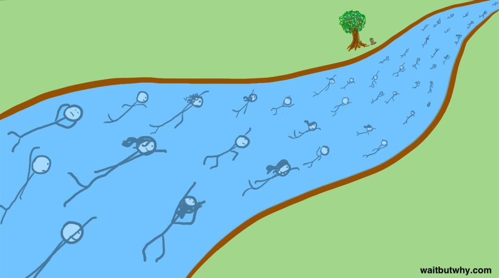

我们没有办法选择河流。我们醒来的那天，就处在这条父母、社会和大环境给我们选定的道路上了。我们被告知了河流的生存法则、正确的泳姿和我们的目标。

我们的工作不是去思考道路，而是在已经被选定的这条路上，按着被预先设定的成功的定义，去获得成功。

对绝大部分读者来说，这条河流通向了一个叫作大学的池塘。我们可能在选择去哪个池塘的时候有一定的选择空间，但是这些叫作大学的不同的池塘，其实没有那么不同。

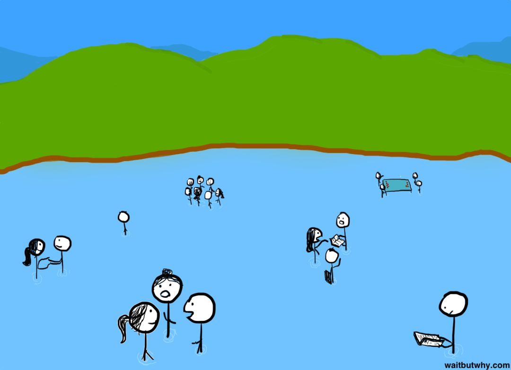

在池塘中，我们有了更多的活动空间和自由度。我们开始思考，开始望向池塘外——看着现实社会的样子，看着那个我们将度过余生的地方。

这些通常会给我们带来复杂的情绪。

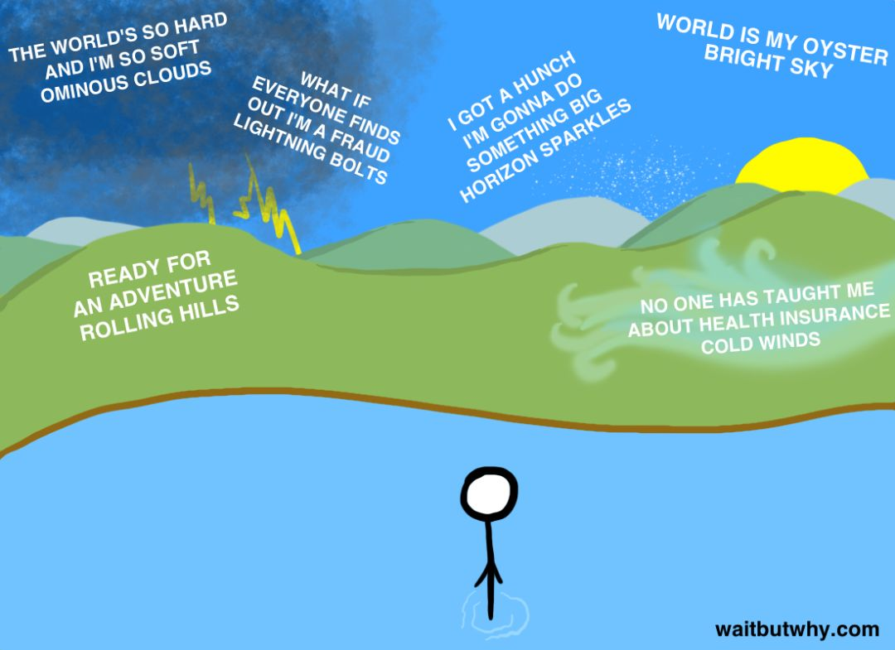

然后，在我们从河流中苏醒的22年后，我们被踢出大学这个池塘，然后被告知“去吧，去创造自己的生活。”

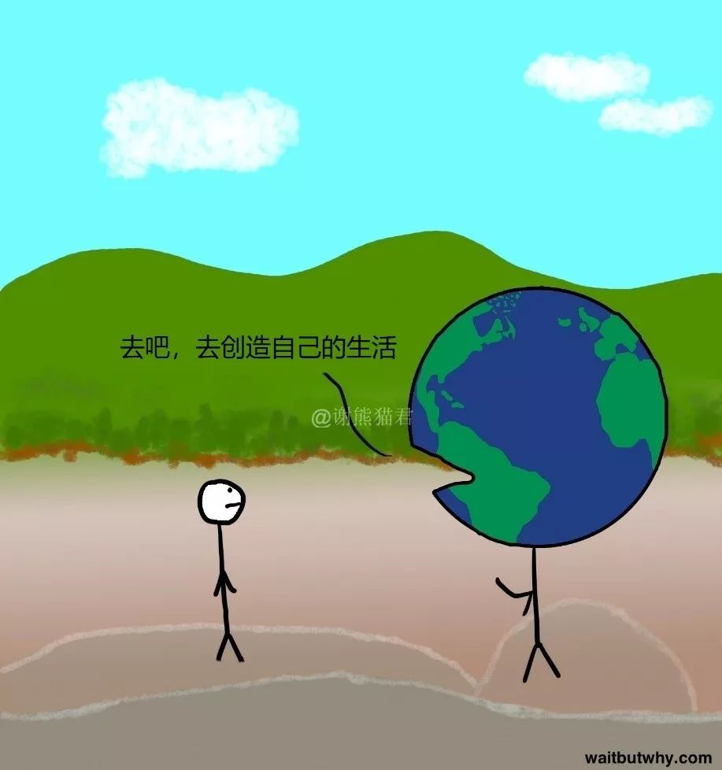

这种安排明显是有问题的。最明显的一点是，你是个没有什么技能，什么都不懂，没有很多其它东西的人。

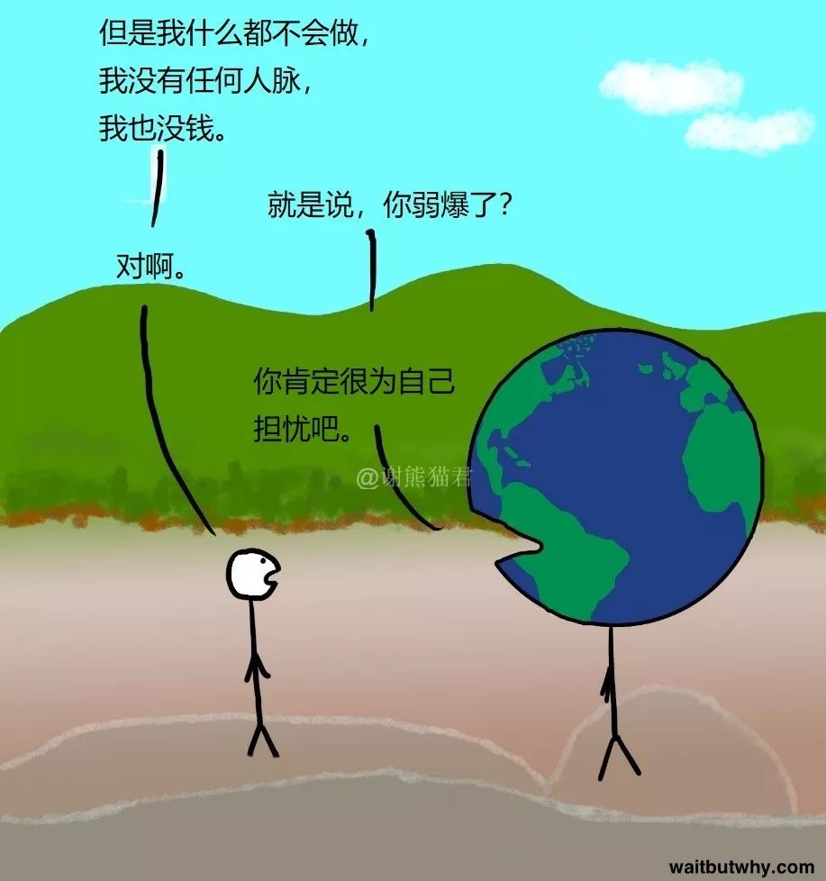

而在你开始解决你的“废柴”问题之前，还有另一个更大的问题——预先设定好的路线结束了。

学校里的学生，就好像有CEO指挥着的公司雇员。但是在现实世界里，没有人会是你生命的CEO，没有人会是你职业路径的CEO——这个人只能是你。

你花了十几年，甚至更久的时间，成为了一个好学生，但是你没有做任何东西的CEO的经验。直到现在，你都只是处理一些非常小的问题——比如“怎么做一个好学生”。

**大学毕业，就像一个只在电脑前玩过模拟飞行的人，手里握着一架波音747的驾驶舱钥匙**。你要回答的问题变成了“我是谁”、“生命中哪些是对我重要的事情”、“我的生活有哪些路径选择？我该选哪一条？我该怎么创造自己的路径？”

当你离开校园，你习惯的生活向导就突然离开了，剩下你一个人站在有无数分叉路的路口，不知所措。 

但是时间不等人。

你会走上一条道路，而这条道路就是你的生活。在生活的终点站，当你回头望的时候，你才能第一次鸟瞰这整条道路。

当科学家研究人们临终时候对于自己一生的感悟时，研究结果是很多人是充满着深深后悔的。很多这种后悔来自于小时候，我们大部分人小时候并没有机会学习如何创造自己的路径。大多数人成年后依然不会创造自己的路径，所以才会在临终回顾时发现自己所走的路有多么荒诞。

这篇文章教的是怎么创造自己的路径。希望读者们能花一个小时，看一下自己正在走的那条路，然后看看这条路通往何方，好让自己确信这条路不那么荒诞。

厨师和厨子
---

我之前写过“第一性原理思维”和“类比思维”的区别，我把它们通俗的成为“厨师”和“厨子”

**“第一性原理思维”（厨师）** 就是像科学家一样思考——把核心事实和观察拿出来，从它们的碰撞中得出结论。就好像一个厨师尝试各种食材来创造美食一样。只要坚持这样做，厨师最后肯定会创造出新菜谱。

而 **“类比思维”（厨子）** ，就是你看着事情已经有的样子，然后模仿一遍。模仿的过程可能会加入一点个人元素，就好像一个厨子照着一个现成的菜谱做饭。

一个完全照着菜谱做菜的厨子，和一个完全独立发明菜谱的厨师，是思维光谱的两个极端。在你生活中所有需要思考和做决定的时刻，你的思考过程总是在这条光谱上的。

你的选择无非是更加倾向厨师，还是更加倾向厨子，是创造还是模仿，是原创还是随大流。

做一个厨师，需要很多的时间和精力。因为你做的事情比重新发明轮子更难，你是要做第一个发明轮子的人。做一个厨师，就好像蒙着眼睛在迷雾森林中摸索，你会面对很多的失败。

做一个厨子就容易多了。

大部分时候，做一个厨师是浪费时间的做法，机会成本非常高，毕竟时间是最宝贵的。我现在穿着品牌服饰和品牌球鞋，这是我在穿衣上面的一种随大流，我走在路上经常能看到和我穿同一个牌子衣服的人。

穿衣上选择随大流是可以理解的，因为穿什么对我来说不重要，衣服不是我用来表达自己个人特点的方式。所以对我个人来说，时尚这个方面，我是愿意用厨子思考来偷懒的。

但是在生活的其它部分上，有一些东西是非常非常重要的，比如在哪里生活，和什么样的人交朋友，是否要结婚，和谁结婚，是否要小孩，怎样抚养小孩，以及怎样设定生活中的优先级。

设定职业路径，自然是这样的一件非常非常重要的事情，其中的道理也很容易理解：

时间
---

对大部分人来说，上班（包括上下班通勤，下班思考工作这些）会占据我们50000到150000小时的时间。

一个长寿的人一生大概有750000小时，当我们减去童年（175000小时），吃饭、睡觉、运动、琐事等基本的维持生命的活动时间（325000小时），你真正的“有意义的成年时间”只有250000小时。所以，一个人的职业，会占据一个人有意义的成年时间的20%到60%。 

这么重要的事情，怎么可以用厨子思维呢？

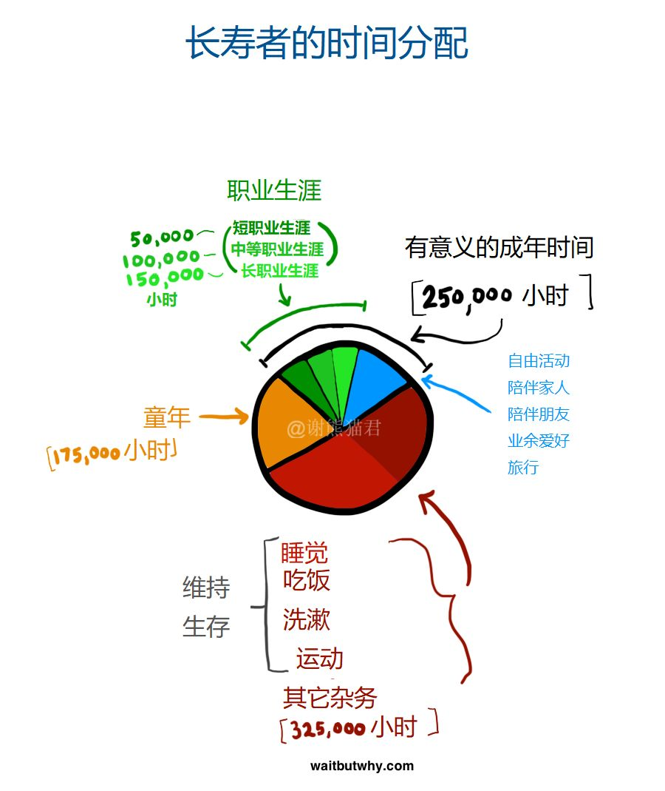

生活质量
---

你的职业对你的所有业余时间，都有重大的影响。对于那些没有财富积累、有钱配偶、巨额遗产的人来说，职业是养家糊口的途径。

而职业的其它属性，会决定你在哪里生活，决定你生活的弹性，决定你在业余时间能做的事情，甚至你会和谁结婚。 

影响力
---

职业会占用你很多的时间，并且是支持你业余生活的途径。除此之外，职业也是你能产生影响力的主要途径。每个人的一生，都会通过不同方式影响到成千上万人，这些被你影响的人又会去影响别人。

虽然我们手头没有时光机，但是如果有的话，我们可以随机选一个80岁的老人，回到八十年前，把那个80年前的婴儿（现在的老人）丢弃掉，再搭时光机回来。我保证，回来后的世界会有无数的不同。

所有的生命都对现在的世界和未来的世界产生着影响。而这种影响力很多时候是在你自己掌控范围内的，因为这一切取决于你的价值观和你自己精力的导向。不管你走向哪条职业道路，世界都会因此而不一样。 

身份
---

小时候，大人会问我们长大后想做什么。长大后，我们通过告诉别人自己的职业来介绍自己。我们不会说“我实践法律”，而是说“我是个律师。”

这也许不是种很好的看待职业的角度，但是现在的社会就是这样的。职业很多时候就是一个人最主要的身份。 

所以啊，职业路径的选择，不是选择今天出门穿什么衣服这样的小事，而是一个非常非常重要的事情，属于那种“无论如何一定要千方百计用厨师思维来应对”的事情。

你的职业地图
---

*三群人*

接下来谈谈你吧，虽然不清楚你的具体情况，但是我猜你应该是出于下图中的蓝色区域——也就是说你正走在职业路径上。  

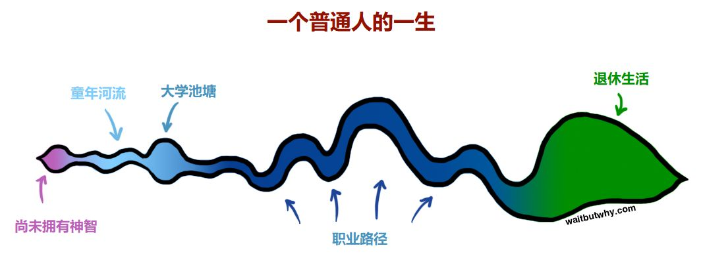

不管你是尚未开始，还是已经走了一段了，你的脑中肯定有一份“职业规划地图”。  

我们可以把拥有职业规划地图的人分成三群，在每一个人生阶段，这三群人都会存在。

**第一群人**，手中的地图上是一个大大的问号。

这些人为自己的职业路径犹豫不决。他们被告知要追逐自己的心之所想，但是他们对于什么事情都不是特别感兴趣。他们被告知去做自己擅长的，但是他们不知道自己最擅长什么。他们过去可能有清晰的想法，但是他们不再是过去的自己，他们不再确定自己是谁，不知道自己想去哪里。 

**第二群人**，他们的地图上有一个清晰的箭头。他们相信这个箭头的方向是对的，但是双腿却走向了另一个方向。他们活在一个最常见的人生困境之中——走在自己内心知道是错误的职业道路上。

**最幸运的第三群人**，他们知道想去什么方向，并且相信自己走在正确的道路上。

但即使是第三群人，也会时不时的停下来问自己，“这个箭头究竟是谁画的？真的是我自己吗？”

这个问题常常无解。

这三群人，都能从自省职业路径这个事情上获益。

有些读者可能会说，你就是个网上写文章的人，你真的能帮到我吗？

好吧，我来罗列一下我的资质

1.  过去二十年我一直在分析我的职业路径
    
2.  我的路径有过很多转折。7岁时我想做电影明星，17岁时想做美国总统，22岁时想做电影主题曲作曲家，24岁想创业，29岁时想写音乐剧，最近，我想做个作家式的人。
    
3.  我的大部分人生都在职业路径上浑浑噩噩，但是我现在很爱我的工作。这一切有可能会变，但是在我人生的决策流程中，看到了那些造成错误结果的决定，和那些带我去到正确方向的决定，让我更加了解哪些地方是人们容易误入歧途的。
    
4.  除了我的个人故事外，我还近距离聆听了很多亲密朋友的故事。在深度观察和反复讨论朋友们的职业道路的时候，我对于这个话题有了较广的眼界。这也帮我认清了哪些问题是我独有的，哪些则是普世的。
    
5.  最后，这篇文章不会告诉你哪些职业更好，哪些更坏，哪些更有价值，哪些不值得去做。有很多学术研究能够解答这些问题，但是这篇文章不会。这只是一个职业路径自省的框架，目的是帮助读者更好更诚实的面对自我。这个框架对我自己很有用，我觉得对于其他人也许也有用。现在我们重新明确了你的职业地图，以及上面可能存在的箭头，请你把这张地图丢的远远的。我们要到文末才重新来回顾这幅地图了。
    

重新画地图
---

现在我们要深度思考，然后重新画一张地图。

我们首先要创造一张维恩图。

**第一步是画一个“想要”框**，这个框里应该装着所有你想要的职业

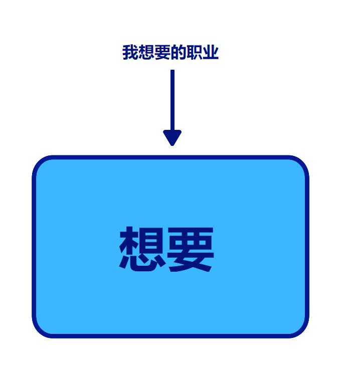

**第二步是画一个“现实”框**。这里面应该装着所有可能的职业，或者你的潜力能够达到的职业。这取决于你在不同领域的潜能，以及在各个领域取得成功的普遍难度。

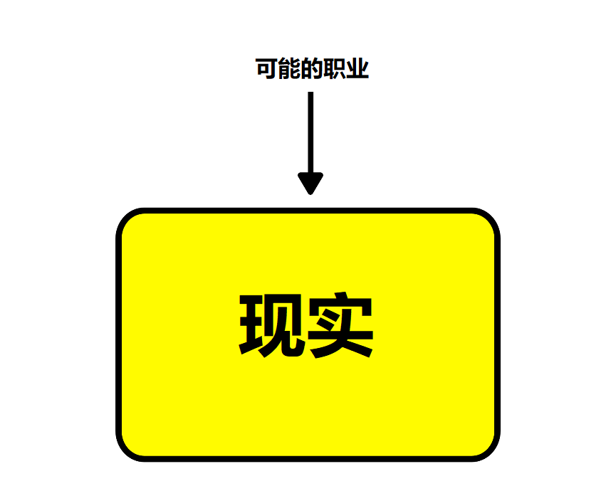

两个框重叠的地方，就是你的最优职业选择。这部分的职业，才是应该画在你的职业规划地图上的箭头，我们称这个**重叠部分为“选项池”**。

这个方法看起来很直接，但是要准确的填充这两个框还是很难的。为了让这个方法行之有效，我们需要让这两个框无限接近事实。要达成这样的效果，我们要狠狠的拷问自己的内心。

我们先从“想要”框开始。 

深度分析一：“想要”框

**开篇**

**深度分析一：想要的职业**  

欲望八爪鱼

解剖欲望

欲望的冒名者

否认监狱

欲望的优先级

**深度分析二：现实的职业**

**理清未来的头绪**

**最后的话**  

“想要”框的填充难点在于，你有很多不同的想要的东西。或者说，你有很多不同的方面，各个方面的自己都有想要的和恐惧的东西。

既然意志是会互相冲突的，你就不可能获得所有自己想要的东西。获取一件想要的东西，很多时候就意味着不能获取另一件东西。有时候这两样东西可能是完全相矛盾的。

“想要”框，是一场和自己的妥协游戏。 

欲望八爪鱼
---

要好好的填满“想要”框，就要认真的思考自己想要从职业中获得什么，为了帮助大家做到这点，我们需要借用“欲望八爪鱼”的帮助

我们每个人都有自己的欲望八爪鱼。每个人的八爪鱼都长得不同，但是差别不会那么大。我敢打赌，大部分人的欲望和恐惧是相似的。

首先要明确的是，欲望有很多大类，分别生活在八爪鱼的不同触手上。这些触手互相之间常常吵架。

还没完呢。每一只触手，都是由不同的欲望组成的，这些欲望和恐惧，彼此之间常常充满巨大的矛盾。

我们一根根触手来看吧

个人欲望触手
---

**个人欲望触手（Personal）**可能是最难概括的，每个人的个人欲望都不一样。这根触手是每个人性格和价值观的折射，而它本身承担着最复杂和最有挑战性的人类需求：满足感。

这只触手上不只承担了现在的你自己，还承担了过去的很多个“自己”。

7岁时候的梦想，

12岁时候的理想主义认知，

17岁时候的小秘密，

现在的自己的心中所想...

全部散落在个人欲望触手上。每个“自己”都想分一杯羹。而一旦任何一个“自己”没有得偿所愿，它都会让你内心充满失望和失落。

除此之外，你对于死亡的恐惧，也会出现在个人欲望触手上。好比想要在世界上留下点印记或者成就伟大事业这些。个人欲望触手的存在，就是为什么非常多的亿万富翁，不愿意余生纸醉金迷，享乐人生——这根触手的需求很强。

然而，个人欲望触手也是最常被忽略的那个。在很多的案例中，个人欲望是最不被待见的，因为这只触手上承载的恐惧常常不是那么紧急，而且在事业的早期，其它的触手往往因为本能的蛮力而占据上风。

这种忽略，往往在尘埃落定后会给人留下重大的遗憾。未被满足的个人欲望，常常是那些非常成功却不快乐的人，真正不快乐的原因——他们获得了成功，却不是在自己想要的领域。

社交欲望触手
---

**社交欲望触手（Social）** 是最原始，最动物性的一根触手。这只触手上的驱动力，源自我们的生物演化过程，这只触手上的生物非常特别。  

我们内心都存在着“社交存活”的欲望，我们因为这种欲望而无比关注别人对我们的想法。这意味着我们希望被接受、被包容、被喜爱。同样的，我们不喜欢尴尬、负面评价和非难。

然后就是你的自尊心。它和“社交存活”很像，但是需求更强烈。你的自尊不但想要被接受，还想要被崇拜、被渴望、被讨好，而且程度越大越好。

自尊心被厌恶是很难忍受的，但是更难忍受的是被忽视。你想要被人广泛的认可和看重。

这只触手上还有别的角色。比如当你没有得到适当的赞赏的时候，你内心的小法官就会生气。在小法官的心中，别人最好能够和你一样正确的认识到你自己的聪明才智。而且小法官还很记仇，所以很多人会有在不相信自己的人面前逆袭的幻想。

最后，还有一条小狗也住在这只触手上，这只小狗最大的愿望就是取悦它的主人，最不能接受的就是让主人失望。

然而，这只小狗的主人并不是你，而是那个在心理力量上对你有掌控的人，你可能竭尽自己的整个职业生涯，只为用成就去取悦这个人（比如一个要求很高的家长）。

生活方式触手
---

**生活方式触手（Lifestyle）** 想要的基本是岁月静好，好比一个快乐闲适的日子，大把的空闲时间，休息放松，享受舒适。  

它同样从宏观的层面关心你的生活，它希望你在自己认可的时间，能用自己想要的方式，和你喜欢的人，做自己想做的事情。生活应该充满快乐的时光和丰富的经历，应该没有坎坷，应该有着极少的辛劳或挫折。

问题是，如果你把生活方式的欲望放在一个很高的优先级，你很难让整根触手都满意。想要满足那部分成天葛优瘫的欲望，就无法去奋斗打拼出长期的财富来支持对奢侈生活的欲望。

未来稳定可期的欲望被满足，意味着触手上另一部分的想要长期自由生活的欲望要被掐灭。想要没有压力的度过一生的欲望，和想要像王石一样攀登珠峰的欲望，其实没有办法和谐的相处。

道德欲望触手
---

**道德欲望触手(Moral）** 认为其它的触手都是没有良知的混蛋，个个都只知道自我享受。道德欲望触手上的你举目四望，看到这个世界到处是需要被解决的问题，你看到亿万人因为投胎错了地方而无法享受优渥的生活，你看到地球生命面对着乌托邦和反乌托邦之间的不确定未来——而这种不确定的存在都是因为每个人身上那些自私的其它欲望触手的存在。  

其它的触手在幻想的是如果你有十亿美元，你会过上怎样的生活；道德欲望触手在幻想如果你有十亿美元，你能产生什么样的影响。

很自然的，其它的触手很讨厌道德欲望触手。它们同样无法理解慈善和公益——“别人又不是我，为什么我要话费时间和精力去帮助它们？”它们只能理解那些对自身有利的慈善和公益。

道德欲望触手和生活方式触手常常正面冲突，其它触手却时常可以和道德欲望触手合作。如果公益行为能赢得来自特定社交团体的尊重和崇拜，社交欲望触手往往愿意做公益；个人欲望触手也常常能从公益行动中找到意义和自我价值。

所以，当你从事公益，或任何无私的事情的时候，内心总是有几样单独的想法在发生。想要通过付出获得公众认可的想法活在社交欲望触手上，想要获得“我真是个好人”这种满足感的想法活在个人欲望触手上，那些真正想要看到弱势群体获得更好生活的想法活在道德欲望触手上。

同样的，不为别人付出也会伤到数条触手。负罪感和悲伤会伤害到道德欲望触手，被他人认为自私和贪婪会伤害社交欲望触手，对自尊的减低会伤害个人欲望触手。

实用主义触手
---

**实用主义触手（Practical）**认为其它触手想的都还行，不过它还想提醒你，明天要交房租了，而你银行账户里的钱其实不够交房租，而你离交房租只有34个小时了。  

是的，它知道你已经在昨天就把支票投进去银行了，而且明天早上金额就会到账。但是它同样记得，上个月同样的交房租的紧张时刻，其它的触手都保证会节省开支来提升一下银行存款数字，使得交房租这个事情不会每次都这么有压力。

实用主义触手还发现，上周六你和一堆人一起去酒吧的时候，社交欲望触手请所有朋友都喝了一杯，因为这样朋友们会觉得你是个很有品，很慷慨的人。

而生活方式触手，选择租了一个很棒的公寓，而租金对你这个月光族来说还是很辛苦的。

你的道德欲望触手，在半年前投资了一万多元，帮你一个潦倒的朋友经营点心外卖业务，但是好像这门生意最近没啥业务更新了。

而你的个人欲望触手，虽然推动你同时做两份实习工作，但是赚的钱还没有你大学时候去主题酒吧做服务生赚的小费多，这让大家都非常郁闷。

实用主义触手的底线在于，它想让你不用饿肚子，有衣服保暖，买得起药，并且不需要露宿街头。它并不在乎这些事情要怎么实现，它关心的是这些事情需要实现。但是其它的触手总是不能让实用主义触手得偿所愿。

每当你的收入增长的时候，你的生活方式触手就会提高它自己的欲望和期望的标准，使得实用主义触手一直在努力给生活方式擦屁股，保证你能每个月都能还的上信用卡。

你的个人欲望触手还有其它各种奇怪的需求，这些需求占据你的很多时间，却并不怎么赚钱。虽然实用主义触手非常愿意拉下面子让你去啃老，你的社交需求触手却拉不下这个脸，因为这“太丢人了”，而个人需求触手也觉得“我们不至于这么惨”。

所有就是这样的，你的欲望八爪鱼有着很多只触手，每一只触手都和彼此起着冲突。 

每一根触手上还有各自独特的欲望，这些欲望即使在自己触手内部都会互相打架。更甚者，有时候在单个的欲望内部，你都会和自己起冲突，就好像你想要做自己想做的事情，却不知道自己想做什么。

或者，当你很想要被人尊重，但是却发现自己的职业选择在赢得某些人的尊重的同时，也会收获别人的反对，甚至是一些人的白眼。

而当你决定满足自己助人为乐的欲望的时候，你会在

（1）为了人类的长期生存危机而做一些暂时看不到成果的贡献，

（2）为自己的本地社区作出一些立竿见影的影响，这两种选项之间，不断纠结。

而不管选择哪个，你都会为自己的冷血无情而感到心寒。

欲望八爪鱼真的很复杂。没有哪个人类能够满足整只欲望八爪鱼。人类的欲望，是一场选择、牺牲和妥协的游戏。

解剖欲望八爪鱼
---

我们来回顾一下“想要”框吧。当我们想着职业目标、恐惧和梦想的时候，我们在考虑的其实是欲望八爪鱼的净产出，这通常也就是它最长的那只触手。

只有深入的挖掘我们内心的潜意识，我们才能看到那些在真实发生的事情。

我们每个人都有能力来挖掘内心的潜意识。潜意识里的内容，就好像地下室里面的东西——我们不是没有能力去看，只是它们在地下室，所以我们平常看不到而已。

我们随时可以去查看它们，只要我们能够

（1）时刻记得房子有一个地下室，

（2）真的花时间和功夫下去地下室看看，哪怕下到地下室未必是个舒适的体验。

所以，让我们去地下室看看欲望八爪鱼吧。

除非你之前经常练习分析自己的潜意识，不然你的这个地下室估计一片漆黑，使得找到欲望八爪鱼一开始有点困难。最好的开始，就是先把灯打开。打开灯的方法，就是通过你的意识，来辨识你此刻的欲望和恐惧，然后把这些内容都抖出来。

比如，如果有一条职业路线非常符合你的幻想，把这个职业路线抖出来。哪一条触手最希望获得这份职业呢？这条触手上的哪一部分最想获得这份职业呢？

如果你现在没有在为了这份职业路线而努力，那就先搞明白为什么。如果是因为你害怕失败，那把这份恐惧抖出来。

对于失败的恐惧，可以来自任何一条触手，所以这样的分析就不够彻底，你一定要明白这份恐惧关联的是哪一条触手的哪一部分。

是社交欲望触手上对于困窘的恐惧？还是害怕被人评价为不够聪明？还是害怕在你的爱人眼中显得不那么成功？

还是个人欲望触手上，对于自我想象被破坏的恐惧？

还是生活方式触手上，对于生活质量降级的恐惧？还是恐惧给现有的可预期的生活带来压力和不稳定？

或者对于生活质量降级的恐惧不是来自生活方式触手，而是来自社交欲望触手？也就是说，你自己对于换个便宜住所住不是很在意，但是你很在意这样的降级会让朋友和家人怎么样。

或者是因为你有财务上的付出，让你不能立刻抽身，而你的实用主义触手对这个情况感到非常恐慌。

万一这份职业上的变化要花比预期更久的时间来获得收益怎么办？或者不管花多久都没有办法获得收益怎么办？

或者，你对于迈出这一步的恐惧，来自于多种恐惧的结合。也许你觉得不是对于失败的恐惧在阻挠你，而是其它的因素。

也许是这种职业的变化带来的对于身份变化的担忧，这种身份变化可能是内在的也可能是外在的。

可能是一直以来的惯性在阻挠你，而这种惯性一直在助推着你的欲望。 

不管如何，你需要把这些感受都抖出来，然后诚实的问自己，究竟是那一根触手如此反对身份的改变，或者是一直被惯性在助推着。

也许你想要做个有钱人。你常常幻想每年收入几百万的生活，而你一直在努力实现这一切。所有五根触手，都会在特定环境下对财富产生渴望，每根触手会有各自不同的理由——把这些情况都抖出来。

当你把这些赚钱的内在驱动力抖出来的时候，也许你会发现，在这一切驱动力的核心，你的核心驱动力是安全感，而不是巨额的财富——这也是应该被抖出来的。 

**对于安全感的渴求**，最简单的形式，可能是实用主义触手在起作用，也可能是你的生活方式触手和社交欲望触手对于生活的奢华有一些基本的要求。

或许你对安全感的奢望如此之高，它不再是一种对于安全感本身的欲求。而是不管你经济状况如何，你都想摆脱成长过程中那种对于财务压力的不安感，而生活方式触手上关于情绪健康的部分一直驱动着你去追逐这种没有财务压力的安全感。

对于所有这些问题的回答，存在于你的欲望八爪鱼的触手上的某些部分。对自己提问，并且深挖，能够帮你辨识自己欲望的根源。这个过程中，你会逐渐打开地下室的灯，并且逐渐和欲望八爪鱼熟络起来。 

在这个过程中，你还会意识到你的哪一部分欲望叫的最响亮，最能影响你的决策过程。很快的，一个欲望的排序就会出现。

你会发现那些叫得最响的欲望；那些哭的很凄惨，但是总是被更高优先级的欲望挤到一边的欲望；你还会发现那些自艾自怜的低优先级欲望。 

欲望的冒名者
---

我们在往前推进，但这才刚刚开始。当你明白了自己的欲望八爪鱼后，你才算刚刚开始。你要做的是在潜意识挖掘上再深一层，去到比地下室更深的地方。你可以在这里**建起一个审讯室，然后把每个欲望一个一个的带进来审问**。

对每一个欲望，你要问的是：_你为什么会在这里？你为什么是现在这个样子？_

欲念、信仰、价值、恐惧不是凭空出现的。他们要么来自于内心意识在观察和生活经验的长时间浇灌，或者来自于别人从外部对我们的植入。

也就是说，它们要么是你用厨师思维发明出来的，要么是你用厨子思维学来的。

所以在你的审讯室里，你要做的是扯着每一个欲望的脸皮，好好看一下它就是是来自于自身，还是来自于别人。

扯脸皮的效果可以用“为什么游戏”来达成。你最初的为什么问题，应该是“为什么这是我想要的东西？”你会得到一个原因。

然后你会继续提问，_为什么这个原因会让人产生渴望？为什么这个原因能在你心中占有如此重的重量？_

你的原因会被挖的更深一层。

只要你持续的做，你会得到下面三种结果之一：

（1）你会把原因一直追寻回它的起源，摸清你从独立思考开始获得这个原因的完整思维链。你扯着这个欲望的脸皮，会发现它并没有戴着面具。

（2）你会把原因追寻回到那个把这个原因植入给你的人——比如“我的家长曾经逼着我接受这个观点”。然后你会发现你从未真正同意这个观点。你所积累的智慧并不能真的让你确信这个信念的核心合理性。

这种情况下，其实就是一个冒名的欲望在假装成你真正的欲望。你扯着这个欲望的脸皮，然后把它的面具扯了下来，露出了它的真面目。

（3）你会在追寻原因的根源中迷失了，“我不知道为什么，就是觉得它是对的”。这种情况，可能是你的真实欲望，也可能是冒名者的另一种伪装，你只是一时想不起来是谁把这个想法植入给你的。

在你内心的最深处，你对这种情况的真实归属有着一定的直觉。

如果是情况（1），这就是一个真实确凿的感觉或者价值，来自你的厨师思维。  

如果是情况（2）或者（3），你会发现自己被耍了。别人趁你不注意偷偷溜进了你的欲望八爪鱼体内，动了些手脚。对于那部分的信仰，来自于厨子思维，你只是像个机器人一样，在重复别人的菜谱。

如果你是一个聪慧过人的人，你的这番自省会让你意识到你的欲望八爪鱼基本上是自己造就的，并且上面的欲望紧跟自己的现况。

但是大多数人，会像作者一样，发现很多的冒名者，或者很多的情况（3）。

当你掀开冒名者的面具，发现其实有些信念来自你的家长：

其它的一些冒名者的面具被扯下来后，你会发现它们来自于常规认知，或者是你所生活的社区念，或者是你所处的年龄段的文化，或者是你的亲密朋友圈

有时候，你在这份追溯根源的问答中，会找到名著中的思想，你的偶像曾经说过的话，或者你的教授经常重复的强烈观点。

你甚至会发现你的一些欲望，是小时候的那个你写下的。那个被深深刻在意识背面的童年梦想，是完全诚实面对自己时，才会承认的欲望。

审讯室不会是非常让人心情舒畅的一个过程，但是这个时间是值得的。

你不是小时候的你，就好像你不是你的父母，也不是你的朋友，更不是你的同龄人、社会、偶像，你同样不是过去的决策和当下的环境。

**你是“此时此刻的你”，唯一一个，独一版本的你自己。你是唯一一个有资格来决定你想要什么，不想要什么的人。**

要说清楚的是，这不代表听从睿智的父母的建议，或者著名哲学家的思想，或者你尊敬的朋友的观点，或者年轻时候的自己的信念，是错的。谦卑的人是能够被影响的，来自外界的影响是我们自身重要而不可或缺的一部分。

但是这里要搞清楚：

你是把这些外界影响作为信息，经过内在的真实自己的思考后，再小心的决定接受；

还是说这些外界影响直接攻占了你的大脑，占据了你的内心？

你是因为听到别人想要什么，结合自己的生活经验，然后决定此时此刻你也想要同样的东西；还是你听到了别人想要什么，然后觉得“我什么都不懂，那家伙好像挺懂的，所以如果他想要那个东西，那应该没错了”，于是把别人的思想刻在自己脑子里，不再去质疑这种想法？

前者是厨师思维，后者其实就是做个机器人。做一个机器人，意味着你内心觉得别人比你自己更适合为自己做决定。

好消息是，所有的人都会犯这个错误，而且你能纠正这个错误。就好像你的潜意识随时可以被你自己窥视一样，你同样可以改变、更新和重写你的潜意识。

这是你的思想，你可以对它做任何你想做的事情。

所以，你现在要赶人了。带着面具的冒名者要被赶走，包括你的家长。

赶完人之后，你的欲望八爪鱼可能瘦弱了很多，你可能会觉得都不认识自己了。我们会误以为这是一个错误的感觉，甚至是一种存在危机。但事实上，这样的感觉，意味着你走在了大多数人的前面。 

从天真的过度自信，到睿智而现实的谦卑，所经历的落差并不舒适。

但是像大多数人一样在悬崖边固步自封，躲避痛苦，并不是个很好的策略。

智慧和知识是不相关的，智慧只和认识现实相关。智慧不代表你需要在上图的X轴上走到多右边，而在于你离橙色虚线有多近。

获得智慧一开始会很痛，但这是唯一一个会让人成长的地方。讽刺的是，那些止步于悬崖前的人，喜欢嘲笑那些勇敢跳下山谷，然后持续攀登的人。因为这些止步悬崖的人，不知道怎样去了解自己，他们还没体会到那一步。

认识到真正的自己是非常难，而且永远不会结束的一段旅程。但是只要你从悬崖跳下去了，你就已经完成了入门仪式，接下来，你就能不断的进步了。

在你沿着橙色虚线攀爬的过程中，你会渐渐的用真实的自我欲望，来充实你的欲望八爪鱼。

你也许不会很明显的知道那些缺失的欲望究竟是什么，因为它们存活在潜意识的更深一层。它们是在地下室（潜意识）的地下室（审讯室）的地下室，我们把它叫做**“否认监狱”**。 

否认监狱
---

我们内心的否认监狱，是个大部分人都意识不到的地方，那里存放着被我们压抑和否认的欲望。

那些我们在审讯室里发现的真实的自我欲望，是比较容易被发现的。因为它们径直的站立在我们的潜意识里面。

即使是你的自我意识，也知道这些欲望的存在，因为它们常常从地下室走到地面，在你的思想里跳跃。我们和这些欲望的关系是比较健康的。

但是还有一些真实的欲望，并没有活在你的欲望八爪鱼身上。它们本该存在的位置，被冒名者们占据了。这些遗失的欲望，很难被找到，因为它们生活在潜意识的极深处，在一个几乎不存在的地方。

那些被我们驱逐的欲望被关在否认监狱里，因为面对它们或者想起它们会非常的痛苦。很多时候，这些欲望刚诞生，就被我们锁进了否认监狱。我们的顽固，常常让我们去否认自己的演变。

当然，也有时候，这些欲望是被其它人锁进欲望监狱的。

有一些你的真实欲望，是被带着面具的冒名者关进否认监狱的。

如果你的家长说服你，其实你想要的是一份高大上的工作，那么他其实同时也说服了你，那个对于成为一个手工艺人的内心渴望，并不是真的你。

在你童年的某一刻，你对于手工艺的渴望，就被你的家长关进了阴森的否认监狱。

所以，让我们鼓起勇气，走进这个地下室的地下室的地下室，来看看我们能发现什么。

你可能会见到一些不那么让人愉快的怪兽

先不要管这些怪物，我们先去找那些和事业相关的欲望。

也许你会发现一个长期被压抑的做老师的渴望，也许是成为名人的念想，也许是被年轻时候那个稚嫩冲动的你踢进监狱的对于大段悠闲时间的喜爱。

因为否认监狱真的很黑，所以有一些真正的欲望你没有办法发现。但是请给自己一些耐心，因为你已经在你的欲望八爪鱼上给它们留好了位置，它们早晚会浮现出来的。 

欲望的优先级
---

对于你的欲望八爪鱼的排查，还会涉及到对于欲望的排序。和欲望本身同样重要的是它们的优先级。这种层级在我们的实际行动中很容易看出来。

**如果你认为某个欲望很重要，但是你并没有真的在为它做什么的话，那说明这个事情对你来说可能没那么重要**，一些其它你付诸实践的事情，才是具有更高优先级的。

还有要记得的是，欲望的排序，同样也是恐惧的排序。欲望八爪鱼包含了一切你追寻一个职业所想要获得和不想要获得的东西。

每一个欲望，反面都是对另一个极端的恐惧。你对于被人崇拜的欲望，背后是对于窘迫的恐惧。你对于自我实现的欲望的背面，是对于碌碌无为的恐惧。

你对于自尊的欲望，背面是对于羞辱的恐惧。如果你的行动和你内心对于欲望的排序不符合，通常是因为你忽略了你的恐惧所扮演的角色。对于成功孜孜不倦的追求，可能只是从负面个人形象的逃离，或者只是对羡慕或者不被赏识的反叛。

如果你的行为指向了那些你并不怎么关心的欲望，你可能需要仔细看看你的恐惧。

当你同时考虑了欲望和恐惧，再想想你内心的排序是怎样的。然后记得问一下那个重要的问题：“这个顺序是谁创造的？真的是我自己吗？” 

举例来说，我们常常被告知“追随你的热情”。这个说法其实是社会告诉我们，“把热情相关的欲望放在最前面。”

这是一个非常精确的指示，这个指示对你可能是对的，但也可能不是。这需要你独立的去评估。

要把排序这个事情做对，我建议重新做一下排序，用厨师思维来做，以真正的自己为基准，参考自身的演化过程，然后意识到对此时此刻的你最重要的是什么。

这不意味着把那些叫的最响的欲望和恐惧排在最前面，这样做的话就是让冲动掌控了自己的生活。做排序的那个人应该是你自己，那个正在读这篇文章的核心意识，那个能客观的看待欲望八爪鱼的观察者。 

这会带来另一种妥协。

一方面，你想要利用有生以来积累的智慧做出基于价值观的积极决定；

另一方面，是关于自我接受和自我妥协。

有些时候，你会有一些很强的，无法否认的欲望，但是你难以为这些欲望感到骄傲。但是无论如何，这些欲望是你的一部分，当你选择忽略它们，它们会不断的刺激你，让你感觉非常糟糕。

**创造你自己的欲望排序，是在“什么是重要的”和“什么是你”之间的一场妥协**。也许把更高的优先级给予那些更加高尚的特质是个好的目标；但是把那些不那么好的特质也往前排一下也无妨。

这条线怎么划，要看你自己。知道什么时候去接受自己不那么高尚的特质，什么时候去拒绝它们，也是一种智慧。

创造一个好的顺序，你需要一个好的体系。你可以用自己喜欢的方式来做，我喜欢的则是一个书架体系：

书架就把所有的欲望分成了五类。最高优先级的内心驱动力进入了**“最特别的没有商量余地碗”（最特碗）**里面。最特碗装载的是你最重要的那些欲望，你无论怎样都想要这些欲望被满足，如果有必要，你可以抛弃其它所有的欲望。

这其实是为什么，那么多历史上的传奇人物会想事情一根筋，因为他们有一个很满的最特碗，而这使得他们常常愿意放弃人际关系、生活平衡和健康，最后成为传奇。

最特碗不大，因为它不应该常常被用到。可能最后装进去的就是一两个欲望而已。最特碗里面装的东西太多了，它的魔力就没有了。碗里装的东西太多，就和没有装一样了。 

**最上层架子的位置，是能够驱动你的职业选择的欲望**，当然这一层上面也不该装太多欲望——排高优先级和排低优先级一样重要。你不只是在选择那些最重要的会让你开心的欲望，你同样也在选择那些你想要刻意回避或者反对的欲望。

不管你怎么排序，总会有一些欲望因为排在后面而不满意，也会有一些恐惧被不断的针对。这都是不可避免的。

这就是为什么，你的大多数欲望应该在中间的架子上、底层的架子和垃圾桶里。**中间的架子是留给那些你愿意接受的，不怎么高尚的欲望的**。它们应该获得你的一些关注，如果你忽视它们，它们很可能会毁掉你的生活。

剩下来的**大部分欲望会被放置在底层架子上**。把你真实的一部分放在底层架子上，实际上就是你在告诉自己“我知道你想要这些东西，但是现在有一些更重要的事情需要关注。我保证，不久后，如果我获得了更多的信息，或者我想法变了，我会把你升级到高一点的架子上。”

最好的看待底层架子的心态就是，你能在底层架子上放的东西越多，高层架子上和最特碗上里欲望越容易被满足。

同样的，最上层架子上放的欲望越少，它们被满足的可能性也越高。你的时间和精力都是有限的，所以这是一个零和的场景。新手最容易犯的错误就是在最特碗和上层架子里面放太多的欲望，而在下层架子放太少的东西。

最后的位置就是**垃圾桶，这是用来放置你拒绝接受的驱动力和恐惧的地方**。人们很多的内心冲突来自于垃圾桶，所以对于垃圾桶的掌控是品德和内心力量的重要组成部分。 

但就好像你的其它排名决定一样，你对于是否把一件东西丢进垃圾桶的选择标准，应该来自于你自己的深度思考，而不是别人给你的指示。

在你经历这个困难的排优先级的过程中，你同时也要面对那些被排低优先级的欲望所发出的痛苦的吼叫。但要记住，你是这个过程中，唯一一个有智慧做这些事的人。

欲望和恐惧缺乏耐心，也没有大局观。即使是那些看起来很高大上的欲望，比如道德欲望触手上的那些，也没有办法像你自己一样看到全局。

很多创造了奇迹，改善了世界的人，在自己的道路开端，可能是出于财富或者个人满足感这些自私的目的。这些自私的目的，最开始可能是道德欲望触手抵触的。

记住，欲望八爪鱼不是那个睿智的成年人，你自己才是。

最后，记得，你做出的不是一个永久的决定。恰恰相反，这是一个用铅笔画的草稿。这是一个你能够测试和修改的命题，测试的过程就是你实际按照欲望排名来生活时的感受。 

至此，你的“想要”框整理的差不多了，下面我们看一下你的“现实”框。

深度分析二：“现实”框

**开篇**

**深度分析一：想要的职业**

**深度分析二：现实的职业**

职业场景

你的潜能

步伐

坚持

你的真实长处和弱点

填满“现实”框

**理清未来的头绪**

**最后的话**

“想要”框关注的是你觉得美好的东西，“现实”框关注的是可能的事情。

当你认真审视“想要”框的时候，会逐渐发现“想要”框里的东西未必是自己真的想要的，而是你以为你自己想要的，习惯了想要的而已。

“现实”框也是一样的，它展现的不是你的现实，而是你对于现实的描述，你对于现实的一个感知。

自省的目的是把这两个框填充的越准确越好。我们想要让感知到的欲望，尽量的接近我们的内在自我。同时，我们也想我们对于可能性的假设，尽量的接近客观上的可能性。

在对“想要”框的审视中，我们观察的是“想要”这个表层下面的东西——欲望和恐惧。而当我们掀开“可能”这个表层的时候，我们看到的是信念。

具体到你在职业上面的可能性，我们关注的是两套信念：关于世界的信念，和关于自我潜能的信念。

一个职业选项要能够进入你的“现实”框，你的潜能必须要和在这个职业领域取得成功的客观要求相匹配。

生而为人，我们其实很不擅长客观的分析这个比较关系的两边。我不太清楚你怎么思考职业路径的难度的，但是在我的经验中，人们基本上是这样假设的：

**传统职业**，比如医学、法律、教育、企业等，这些职业是有可预见的路径的。只要你够聪明够努力，你会到达一个成功稳定的目标。

**还有一些不那么传统的职业，**比如艺术、创业、非营利机构、政治等，这些就很不好说了。成功和稳定不是必然的结果，而要获得巨大的成功，要么运气好到中彩票；要么就是投胎投到非常好的基因，天生自带才能；还有一种情况是这两种好运气的结合。 

这些关于运气的假设是合理的。如果你生活在半个世纪之前，你对于职业的信念，和对于获得成功所需要付出的努力，需要经历你审问欲望一样严格的审视流程。而且我觉得，在大部分这样的信念背后，你会发现其实是靠着常规认知在支撑。

当你把这些信念的面具扒下来后，会发现它们其实是你的父母/朋友/学校职业导师假冒的。而如果你继续扯这些假冒者的脸皮的话，你会发现它们的脸皮其实是第二层面具，这些信念的真实面目其实是一个大众的观念，一个常见的观点，或者一个被反复引用的数据。

这些常规认知，都没有经过你自己的验证，却被全社会当成真理。

今天的世界却时刻在经历着翻天覆地的变化，使得半个世纪前的常规认知已经过于落伍了。然而我们的思维却保留着远古社会的调性，所以还是会习惯于厨子思维，并把常规认知当作真理来看待。

这些问题还会延伸到我们怎么看待自己的潜能。当你高估了天生的才华对于人们职业成败的影响，甚至有时把技能熟练度和天分混淆的时候，你对于自己在很多路径上的成功率是会有一个悲观的预估的。 

因为我们更加理解传统职业的发展轨迹，所以我们更加倾向于做传统职业。

当一个医学院的一年级学生，看到一个资深的外科医生工作的时候，他会告诉自己：“总有一天我也会成为这样一个资深医生，我只需要努力工作二十年就好了。”

而当一个年轻的艺术家或者创业者或者软件工程师，看着它们各自领域的资深人士的时候，他们想到的却是：“看啊，他多么的有才华，我和他差的太远了”，并且因此陷入绝望。

还有个常见的观念，说的是那些在非传统职业中做的好的人，都会有一个“大突破”的机遇，就好像中了刮刮卡一样。而很多人在职业这个事情上，是不愿意寄希望于刮刮卡的。

上面这些还只是对于职业成功的一连串的幻想和误解中的几个例子。下面，我们一起来思考一下职业成功究竟是怎么来的吧： 

职业场景
---

说实话我不太懂这个话题，而且我觉得大部分人也不懂，世界变化太快了。

但这其实就是关键了，如果你能够拼凑出一个足够准确的职业场景的画像，你就比大部分人多了很多的优势，因为大部分人只会用常规认知来作为他们的指南。

首先，要先拼凑出一个宽泛的职业场景——一个人在今天的社会中能获得所有的工作。

我目前的工作是“各种写关于各种话题的8000-40000字长文的作者，顺便还会画点画。”

这样的常规认知下，会有适合我的工作吗？今天的职业场景有成千上万种选项组成，有一些有几十年的历史，有一些可能是因为三个月前的某种新技术诞生而出现的。如果你有一种想从事的职业，但是市场上还看不到，你还可以自己创造一个出来。

蛮有压力的，但是也非常亦可赛艇。 

每一种职业选项都会有一个职业路径。职业路径就像个桌游一样，常规认知的书架上，只有很少的游戏说明书。即使那些有说明书的桌游，也只是在告诉你这款桌游过去的规则。虽然这款桌游的玩法可能已经变了很多，有了很多新的技巧、机会和漏洞。

当你考虑今天社会的一个职业路径，想要对这条路径做出一个准确的评测，理解这条路径适合具备怎样优势劣势的人，你就需要对这个职业现在的桌游规则有一个了解。

打个比方来说，你想通过对自己身高和力量的理解，来评估自己做一个职业篮球手是否合适。但是万一篮球这个游戏，不再是在现有的篮球场地比赛，而是在一个足球场那么大的球场来比赛，球场上有十个篮筐，每个都和一辆车那么大，那“篮球”这个游戏，对于身高和力量的要求，可能就远没有对速度的要求那么高了。

这对你来说其实是个好消息，因为这个世界上可能存在着几十条适合你的优质职业路径，但是在每条路径上的人，可能是在按照过时的规则在竞争。光是了解这个职业路径的新游戏规则，并且按着最新的规则玩，你就比那部分人领先了。 

你的潜能
---

接着我们就要来说说你独特的优势了。我们常犯的错误中，除了用过时的规则来评估自己的长处之外，还有一个就是没有办法通过最新的规则来确认什么样的长处是真正适合新规则的。

当评估你在特定的职业路径上成功的概率的时候，关键的问题应该是： 

**在足够的时间之后，你能不能进步到可以达成这条职业路径上你自己对于成功的定义？**

我喜欢把这条“进步到可以成功”的路程看成一道行程问题。行程的开始，是你现在的状态（点A），终点是你自己对于成功的定义，我们用一个星星来标注。

这道行程问题的距离，取决于点A的位置（你现在所在的位置），以及星星的位置（你对于成功的定义）。

所以，如果你是个计算机专业的毕业生，你的职业目标是成为一个中游水平的谷歌工程师，你的距离大概是这样：

而如果你从没有做过计算机相关的工作，而你的职业目标是做一个谷歌的顶尖工程师，你要走的距离就远了：

如果你的目标是建立下一个谷歌，那这条路就要远好多好多了：

此刻，常规认知可能会从你脑子里冒出来告诉你，熟练的掌握一样技能不能保证成功，你可能摘到了自己那颗星星，但是仍然觉得自己不够成功。

这种说法基本是错的，因为它曲解了“星星”的意思。“星星”不是对于某样特定技能的掌握程度，好比写代码的能力或者演技或者商业能力，星星代表着全盘游戏的成功。

在传统职业里，这盘游戏是比较简单明了的。如果你想做一个顶尖的外科医生，你就要非常擅长做外科手术，然后你就能摘到自己的星星，达到职业的成功。

但是那些非传统职业的游戏往往有更多的因素参与其中。

比如获得“成为电影明星”这个星星，不只是说演技要像摩根.弗里曼那么好，而是说要在“电影明星”这个全盘游戏上获得突破。演技只是这其中的一部分，你还需要能在有资源的人面前露脸的勇气，一股自我品牌建立的机智，非常强大的乐观心态，以及长期的拼命和坚持。

当你在这所有方面都做的够好的时候，你成为一线电影明星的概率就会变得挺高——这才是摘星星的真实含义。

常规认知是不懂这些非传统职业究竟怎么运作的，它只会教你一种狭隘的角度：天分和努力。

在那些有着更复杂游戏规则的职业路径面前，常规认知就束手无措，然后把剩下的东西叫做“运气”。对常规认知来说，它会错误的认为成为一个电影明星需要的是一点天分和大量的运气。 

那么怎样才能算出自己摘到某颗特定星星的机会呢？公示非常简单，小学数学而已。

> 距离=速度x时间

在我们的职业话题场景中，这个公式可以改写为：

> 进度=步伐x坚持

你在任何一个职业追求上的前景，都取决于

 a)你能在这份职业的游戏规则上多快的提高，

b)你愿意用来追逐那颗星星的时间。

我们把这两个都拿出来谈一下。

步伐
---

为什么有些人在职业的游戏上进步的快，有些人却慢？我觉得有三个因素：

厨师思维程度
---

就像我们前面说的，厨师用新鲜的视野看世界，然后通过自己的观察和体验来得出结论。厨子则是通过别人的菜谱来到达结论。

在职业上面，菜谱就是常规认知。

职业是很复杂的游戏，每个人开场的时候几乎都是菜鸟，而“厨师”们是会通过一个闭环来持续提高的：

“厨子”们则是用蜗牛速度在提高，因为他们参考的菜谱是很少变化的。更重要的是，在这个职业游戏不断进化和变化的世界里，“厨师”们的策略可以实时的演变和赶上变化。

“厨子”们的菜谱，则是变得越来越过时，而他们自己还察觉不到。这就是为什么，我会相信，至少对于非传统的职业来说，你的厨师思维的程度，是进步步伐的最重要决定因素。

专业精神
---

这个很明显了。每星期工作60小时，每年工作50个星期的人，比起每星期工作20小时，每年只工作40个星期的人，在职业道路上成长的速度就是要相差大概四倍。

那些选择平衡的生活方式的人，进步的速度就是会比工作狂稍微慢点。那些喜欢偷懒或者拖延的人，就是会比那些秩序努力的人进步慢一点。

那些工作时候总是在摸鱼、偷懒、玩手机的人，能做完的事情就是比那些深度精神集中的人效率低点。

天分
---

天分当然是有影响的。聪明有才华的人，进步会比那些没那么聪明的人快点。但是智商和才华只是天分的一部分。机灵和机智也同样有用，而这两样特质不一定和智商是直接挂钩的。

取决于不同的职业，社交技能可能也会很重要。在很多职业中，招人喜欢的人比不招人喜欢的人要有很大的优势，而那些热衷于社交的人，自然而然会花上更多时间来建立更多的人际关系。 

还有其它的东西，比如已经存在的人际网络，已经存在的资源，已有的技能，也会有影响。但是这些不是“步伐”的决定因素，它们是起点（点A）的决定因素。

坚持
---

当我提到坚持的时候，我说的是长期的坚持，而不是每天好好上班这种专业精神。

坚持比步伐要简单，你花在追逐一颗星星的时间越长，你就离星星越近。一辆30迈的车开十分钟，就是没有一辆10迈的车开两个小时走得远

这就是为什么坚持非常重要。一个只愿意为了自己梦想职业付出三年的时间然后就要返回保底工作的人，其实就是在放弃自己真的获得这个梦想职业的机会。

无论你多么厉害，如果你在努力两三年后没有突破就决定放弃，你是不太可能成功的。

几年的时间，是不够走完摘取最亮的星星做需要经过的漫长旅程的，不管你的步伐迈的多大。 

你的真实长处和弱点
---

讨论完了步伐和坚持的公式后，我们再来看一下长处和弱点这个概念。

我不是说“长处和弱点”是个不好的概念，我只是说我们对于这个概念的理解是错的。当我们列下我们的长处的时候，我们通常是在列我们已经具备技能的领域。

但是**长处不应该是我们的技能，而应该是那些决定我们步伐和坚持的特质。**

独创性，或者独创性的缺乏，是这个讨论的重要因素。比如敏捷和谦卑（厨师思维的重要特点）就是明显的长处，固执、智识的懒惰（厨子思维的标志）则是重大的弱点。

专业精神的那些细微要素，比如更容易深度集中，或者容易拖延，也应该是这个讨论的重要部分。

当然，我们还应该包括才华之外的天分，比如机智和招人喜欢程度。

涉及到坚持的特质，韧性、决心和耐心，都应该是长处。想要快速在人前显贵的心态，则是个明显的危险信号。 

更重要的是，这所有的特质，不应该按照它们现在这个瞬间的情况来讨论，而是要依据你能对每个特质所具有的潜能来思考。

如果我把一个篮球给第一次见到篮球的迈克尔.乔丹，他肯定打得很烂。但是说篮球是乔丹的“弱点”，就是个非常错误的判断。你应该要看他开始打篮球之后几周的进步，分析他的进步曲线。

这个做法对于特定技能的学习很有效，同时对大部分关于步伐和坚持的特质，也有效。

填满“现实”框
---

你的“现实”框，应该包含一个花了一辈子功夫，高度提高后的你，能够获得（你自己定义的）成功的所有职业。

这会是一个非常长的名单，你能排除的只有那些用最大的步伐和最久的坚持都远够不到的职业（对我来说，就是成为奥运级别的花样滑冰选手）。

即使这样的一个名单不太实用，如果你抛开其它杂念想一下，如果你真的能够全心全意的完全开发自己，你自己居然能有如此多的选择，这本身不就是件碉堡了的事情吗？ 

不过，为了效率起见，我们还是只考虑那些最后会落入你的“选项池”（也就是你的“想要”框和“现实”框重叠的部分）的选项吧。要达成这样的效果，我们需要评估一下下面这些因素：

**1）整体场景** 好好评估一下世界上现有的职业场景，包括那些已经存在的，和那些可以被创造出来的。

**2）特定的游戏** 对于任何看起来有一点意思的职业，思考一下这个职业现在的游戏规则是怎样的——游戏参与方、别人最近是怎么获得成功的、最新的法则、最新的被人利用的漏洞等等。

**3）起点** 对于那些有意思的路径，用你现有的技能、资源、相关人脉，来评估一下自己的起点。

**4）成功点** 想一下每一条路上的星星所处的位置。问问你自己，想要获得职业成功，你所要在这条职业路径上获得的最少程度的成功是多远之外。

**5）你的步伐** 做一个自己在不同的职业游戏中的进步步伐的初步预估。这个预估应该取决于你的长处，和你对于这些长处的改进空间（也就是你的加速度）。

**6）你的坚持程度** 评估一下你对于每一条路线愿意投入的时间。

剩下的就是数学了。你把你选择的每一条职业路径画成一条线，你在上面画上起点A和终点星星。这样你会得到一段一段的距离。

然后计算每一段距离你能迈出的步伐和付出的坚持。如果步伐和付出的乘积能超过每一段距离的长度，那这条线所代表的职业就可以进入你的“现实”框。当然，上面这些计算都不太可能获得精确值，但是能够获得一个有近似值的公式，也是很有益了。

一个经过厨师思维产生的“现实”框的填充过程，会把一些过于乐观的人变得更有底气。同时对于大多数人来说，这个过程会让他们意识到，他们比自己原本想的有更多的选择，会让他们更有力量，更敢于选择前面的方向。

一个好的“现实”框的填充过程，肯定会让你对“想要”框也产生一次自省。在脑中重构职业路径，带来的肯定是你对不同欲望的看法的改变。

一份需要成千上万小时交际或者数十载煎熬的工作，可能不会再像原本那样吸引你。另一份其实不是真的像看上去那样需要靠运气的工作，也许会在这之后显得更加平易近人。

还有一些职业路径，因为你之前没有真的考虑过它们，而不知道自己内心很渴望它们。但是这样的自省后，你的想法也变了。

我们对于“想要”和“现实”的深度分析到此就结束了。经过这深度的思考过程，我们可以回到最初的维恩图了。

相信此时的你已经看到一些改变了，你现在有了一个新的“选项”池，里面装满了那些能够满足你最高优先级的欲望，又能够实现的职业选项。此时此刻，你面前有了这些选择，我们该抬头看看未来了。

理清未来的头绪
---

**开篇**

**深度分析一：想要的职业  
**

**深度分析二：现实的职业**

**理清未来的头绪**  

加入问号党

开始行动

行动之后

下一个点呢？

**最后的话**

还记得你最初的那份职业规划吗？就是那个上面画着箭头或者问号的地图。  

如果之前是箭头，那请你再看一眼你的“选项”池。经过了这么多的自省，那个箭头所代表的选项还应该留在你的“选项”池里吗？

如果是，恭喜你，你走在了大多数人的前面。

如果不是，这即是个坏消息，又是个好消息。记住，**从一个错误的箭头，变成一个问号，本身就是重要的进步。**

事实上，一个新的问号代表着你完成了山崖上的信仰之跃。

这个跃下，不但帮助你开始了解自己，也帮助你开始了解这个世界，这是朝正确方向迈出的重要一步。划掉你原本的错误箭头，加入问号党吧。

加入问号党
---

现在的问号党们面对一个问题——需要从“选项”池里选择一个新的箭头。

这是个很难的选择，但你可以把它看得简单一点。

我们原本以为职业就像是一根根40年长的管道。一旦你进入了其中一根管道，你的路径就固定了。你在那个职业工作40年，然后离开那条管道，开始退休生活。

事实上，职业可能从来不是40年长的管道，它们只是看起来那样罢了。退一万步讲，也就是那些传统职业，在过去，曾经像管道一样。

今天的职业，尤其是非传统职业，真的非常不像管道。但是老掉牙的常规认知误导我们仍然这么看职业路径，这使得选择职业路径这一本就不容易的事情变得更加艰难。 

当你把职业看作一条管道，这会让那些不清楚自己几十年后会是什么样，内心又真的不清楚自己几十年后想变成什么样的人，产生身份危机。绝大多数人，都会产生这样的身份危机。

这样的身份危机，让本就容易混淆工作和个人身份的我们，更加容易混淆，让你地图上的问号看起来就好像一场生存危机。 

当你把职业看成一条管道，做出正确选择就好像参与一场赌注很高的赌博，让选择困难症的程度瞬间爆炸。对于完美主义者来说，这简直是件痛彻全身的事情。

当你把职业看成一条管道，你失去了改变职业的勇气，哪怕你的灵魂其实很希望做出这样的改变。它让改变职业显得充满风险和难堪，让那些改变职业的人好像失败者一样。

这同样让那些八面玲珑、充满活路的资深职场人士，觉得自己年纪太大，没有办法做出改变职业这样一个大胆的决定。  

常规认知依然告诉我们，职业就是管道。

常规认知让我们渴望那些我们不真正想要的东西，让我们否认那些真正渴望的东西，让我们害怕那些不危险的事物，让我们对世界和自己的潜能产生错误的认知。

常规认知告诉我们职业就是管道，让我们遭受不必要的恐慌。 

现在的职业场景不是一条条管道，而是一个巨大、无比复杂、快速变换着的科学实验室。现在的人们就是在这个实验室里工作的，内心复杂、快速变换的科学家。

现在的职业不是管道或者盒子或者一个身份标签，而是一系列精彩的科学实验。

乔布斯把生活比作"**connecting the dots**"。他指出，当我们回顾过去，看到那些点是怎么连接起来并且造就了现在的我们，是件容易的事情；而要提前把未来的点连接起来，几乎是不可能的。

如果你看看伟人们的自传，你会发现他们的路径看起来更像一连串连接起来的点，而不是一条笔直可预期的管道。如果看看自己，或者身边的朋友，你也会看到类似的趋势。

从统计数据来说，一个年轻人在一份工作上持续的时间的中位数只有**3年**。即使是年纪比较大的人，平均也只有**10.4年**，没有高得离谱。

把自己的职业发展看成一系列的点，不是一个帮助你决策的心理学小把戏，而是现实的精确写照。把职业看做一条管道不止没有意义，更是一种幻觉。

同样的，你也只能关注路径上接下来的那一个点，因为这是你唯一能看到的点。你不用担心排在很后面的点，因为你没法做这个事情，也没有资格做。

等到很后面的那个点到你眼前的时候，你会懂得很多现在的你根本不懂得东西。你会是一个全新的自己，你的欲望八爪鱼也会随着你一起改变。

你会比现在更懂各种职业场景，更懂具体职业的游戏规则，并且是个更厉害的玩家。而到那个时候，职业场景和游戏规则，同样也产生了很多变化。 

一个叫做80000小时的网站，收集了很多这样的数据来证明这一切。这些数据告诉我们人会变，世界也会变，你只有随着时间的流逝才会知道自己擅长做什么。心理学家DanGilbert也曾经睿智的告诉我们，其实我们没法预测未来会有什么让我们开心。

假装自己能够看透很后面的那些点是可笑的。未来的点，就留给未来那个更睿智的自己去担心吧，我们现在需要做的就是专注于接下来的那个点。 

如果我们把自己想成科学家，把社会想成科学实验室，我们就应该把现在这个“想要”和“现实”组成的维恩图涂当成一个早期而粗糙的假设。接下来的那个点，就是你检验这个假想的实验。

检验假设在婚恋市场是个很本能的事情。如果你朋友为自己想要嫁一个什么样的人而费尽苦心，却从不跟人出去约会，你肯定会告诉她：

“你这样宅在家里是没用的，你需要去跟人约会，这样你才会知道你真正想要的是什么。”

如果这个朋友出去约了一次会，回来后就不停的和你分析这个约会对象是不是她的真命天子，你肯定会再次提醒她：

“就约了一次会，是不可能知道结果的，你需要和这个人多约会几次，才能获得足够的信息来做出这个决定。”

我们作为旁观者，会觉得这个朋友过于愚钝，根本不知道怎么寻找一份快乐的感情。所以在选择职业的时候，我们不要犯和这个朋友一样的错误。接下来要面对的那个点不是什么大不了的事情，它就好像你和某人的第一次约会一样。 

这是个很好的事情，因为这样的想法，会让你在地图上画一个箭头变得不那么可怕，你只是往接下来的那个点上画一个箭头罢了。选择困难的真正原因，是你一边能看到现在社会上可供选择的职业选项，同时又错误的把那些职业看成40年长的管道，这两者的结合是致命的。

把你的下一个重大职业生涯决策，重构成一个赌注低很多的选择，会让众多的选项看起来更加亦可赛艇，而不是充满压力。 

以上这些说起来都不难，下面才是真的难的部分。

开始行动
---

你进行了很多的自省，并且权衡、比较、预测、考虑良多。你选择了一个点，然后画了一个箭头。接着你就要真的开始行动了。

我们其实特别不擅长行动。我们总是担惊受怕，害怕油腻。而采取一个真实大胆的行动，是非常腻味的。如果你的内心隐藏着一个爱拖延的自己，它会在此刻现身。

欲望八爪鱼能够帮你。就像我们之前讨论的，你任何时刻的行为，都只是你的八爪鱼决定的。如果你准备好迈出这一步，但是却没有真的迈出去，那就是因为八爪鱼身上不想迈出这一步的部位，在你潜意识中的排位比想要迈出这一步的部位要高。

你的意识可能尝试过把想保持不变的那些部位放到比较低的架子上，但是你的欲望却在反抗。此时的你，就是个没有办法管控自己员工的CEO 

要解决这个问题，就要把自己当成一个幼儿园老师。在你的班上，有一些五岁的小朋友正在胡闹，你怎么办？

去和那些给你添麻烦的五岁小孩聊聊吧。他们让人不愉快，充满挑衅，头脑简单，但是他们还是会跟你讲道理的。告诉他们为什么你会把他们排在八爪鱼优先级的后面。跟他们描述一下你的“现实”框的自省过程。提醒他们“connectingthe dots”是怎么回事，并且让他们不要把接下来的那个点看得太重。

**你是那个幼儿园老师，你要自己想办法。** 

随着年纪增大，我越来越意识到，我们内心这种幼儿园老师般的挣扎，占了生活中挣扎的绝大部分。这个世界是简单模式，你自己才是困难模式。

如果你发现自己老是没有办法去落实生活中的规划和对自己的承诺，那你的第一优先级的事情就该变一变了——你应该先变成一个更好的幼儿园老师。

在你能做到这件事之前，你会不断被一群原始和短视的五岁小孩干扰，你的整个生活都会很辛苦。

相信我，这是真的。

如果你的内心分析真的告诉你要迈向一个新的点，我希望你能真的迈出那一步。

行动之后
---

迈去一个新的点会给你一种解放的感觉，同时也会伴随着相当可观的内心的动荡。

首先，至少会有一段时间，你会很不擅长那个新的点上做的事情。虽然内心的理智会告诉你这才是正常的，但是你内心中的恐慌会进入存在危机模式。那些你细心排低了优先级的恐惧，会觉得有人想害它们，然后开始暴动。

那些你排高了优先级的欲望，也不会感到很满足。它们会开始质疑自己是不是一直搞错了自己想要的东西。那些你没有怎么排高优先级的欲望，会掏出吉他开始唱情歌，撩拨你的内心。总的来说，这是个蛮糟糕的体验。 

即使一切顺风顺水，你也会看会发现欲望八爪鱼总体来说从来就不是个快乐的生物。八爪鱼的核心部位，会感觉被忽视或者受到了攻击。随着时间的流逝，你会开始承受那些你考虑过，却没有真正去选择的职业路径的机会成本——你会把自己和平行宇宙中做了不同选择的自己做比较。你会脑补出那些你可以做出的改进，并且担心你错过了它们。

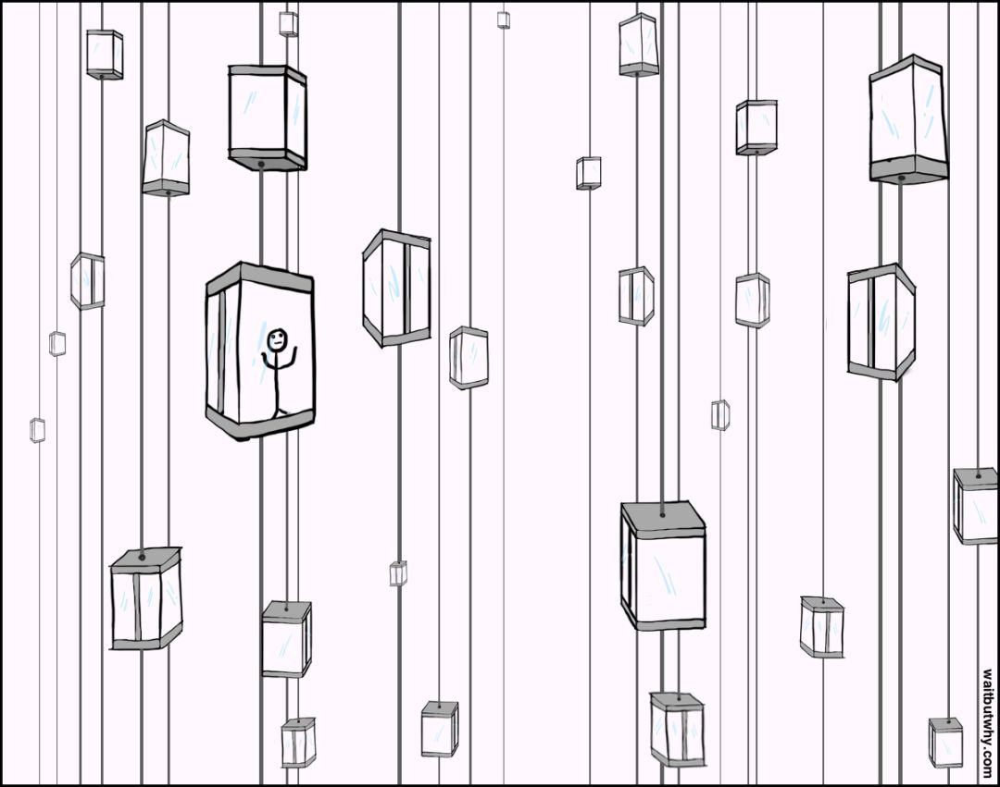

随着你变得更加睿智，你会学着用接受的态度来看待不开心的八爪鱼。你会任它发牢骚，并且学会忽略这些牢骚，因为这些牢骚是你计划之中的。

发牢骚的八爪鱼，正是为什么纯粹而高级的快乐从来都不是一个合理的目标。那些你感觉到纯粹快乐的时刻，是短暂的幻觉。就好像一段感情的蜜月期，一份新工作，或者努力获得期待已久的成功的那一刻。

这些时刻，就好像一个水平一般的高尔夫选手，打出的完美击球一样——这些击球很棒，你也应该好好体验这种快乐感——但是这种快感不代表你是个顶尖的高尔夫球手，你也不会永远都打出完美击球。

一个更合理的目标是知足：那种正在体验一条优质的生命路径的满足感，那种知道自己所作的努力将会变成最终大拼图的一部分的自豪感。**追逐快乐是菜鸟的做法，聪明人的做法，是在选择和境遇的结合给予你应得的一切的时候，感到知足。**

人们总说活在当下，但还有一种更广阔的“当下”的概念，一种更宏观的“当下”——活在你生命的每一个当下。如果在你职业的点上，你能诚实的告诉自己感觉很不错，你应该停下来享受一下。

虽然之后还要再回来重拾大局观，但是在这个享受的时刻，你可以暂时放下大局观，把你所有的能量导向当下。这段时间，你可以好好体验活着的感觉。

这些时刻不会总是持续很久，所以好好享受吧。把一切都带到这个点里，因为正在你身上发生的事情，可能就和迈克尔.乔丹第一次拿起篮球一样。好好的打篮球吧！ 

下一个点呢？
---

早晚，你对于大局的感觉会腻味。当这种感觉来的时候，你又要进入分析模式，然后找出究竟是什么在造成这种躁动。有些时候，宏观的使命不是问题。有可能是你脑子里的厨师决定为了那个宏观使命，你要战略性的跳向下一个点了。这种时候，跳去下一个点不是对于坚持的放弃，而是坚持本身。这些跳点，是对宏观使命的提升。

有些时候，你会感觉到一种更加黑暗的躁动——你怀疑你可能要改变自己的宏观使命了。当这样的情况发生的时候，你需要搞明白这种感觉来自于睿智的自己，还是来自那些低优先级欲望的躁动。

取决于这种感觉的来源，你做出的可能是改变宏观使命的跳点，也可能是一次本质上就错误的行动。

在这种时候，你要好好的考虑在下面的光谱上你站在什么位置：

光谱左边的是羞于起跳的人，他们穿着的是水泥鞋。他们的一个缺陷是会在错误的事情上耗太久的时间。右边的那些是乐于起跳的人，他们穿着的是飞行鞋。他们的缺陷是相反的，他们太容易半路退出了。

你应该格外警惕水泥鞋，心理学家认为临终的人们往往都会后悔惯性不变的生活。一个常见的说法是：“我如果早点退出就好了。”而来自于长辈们的一个最常见的建议就是，“不要做自己不喜欢的工作。” 

这就是为什么这些内心的框架很重要。它们让你能够分析自己冲动的原因。在我们的场景中，要确定的是你想要改变宏观使命是因为一种真实的自我演变，还是习惯于半路而退的偏见。

你的躁动是来自一只配置正确的八爪鱼的预料之中的牢骚；还是来自正确道路的长途跋涉带来的疲劳；还是在旅途中新获得的关于自我或者这个世界的信息，改变了你那些错误的初始假设；或者是因为有些东西在发生根本上的改变，比如一些下图中蓝色或者黄色环的行为：

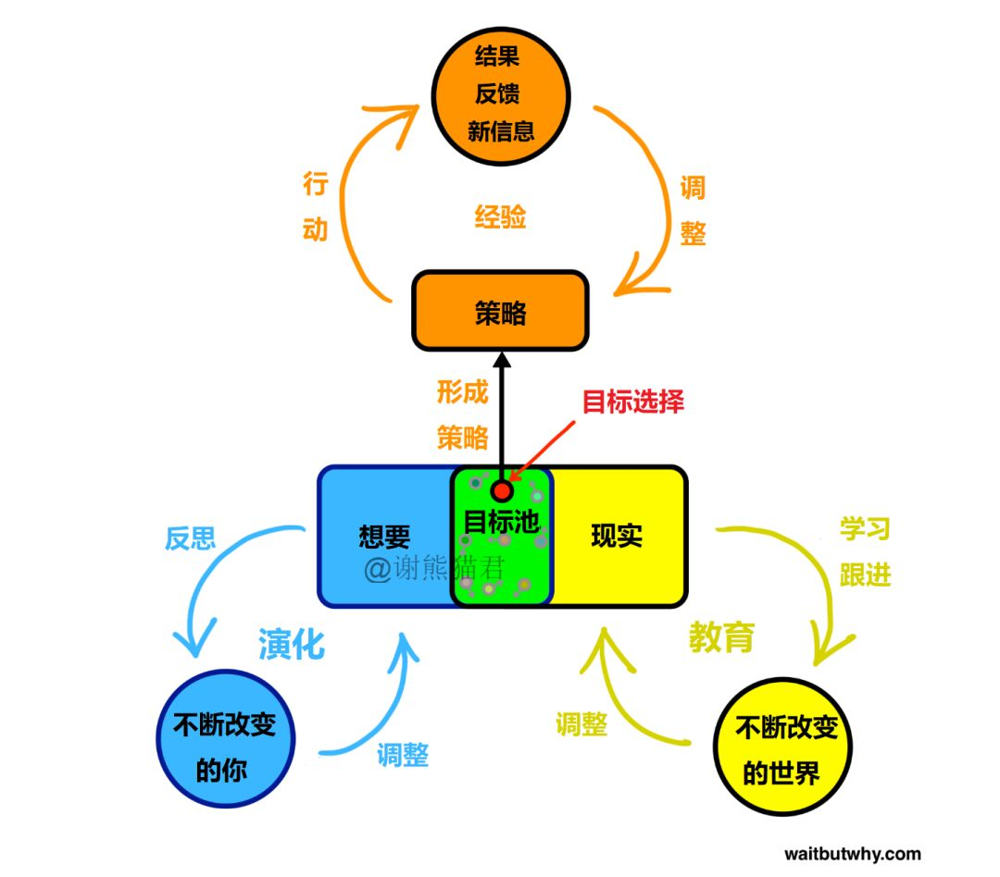

果你觉得事情真的变了，你可能要把视野拉的更宏观一点，想想红色圈子，也就是从根本上改变自己的使命。

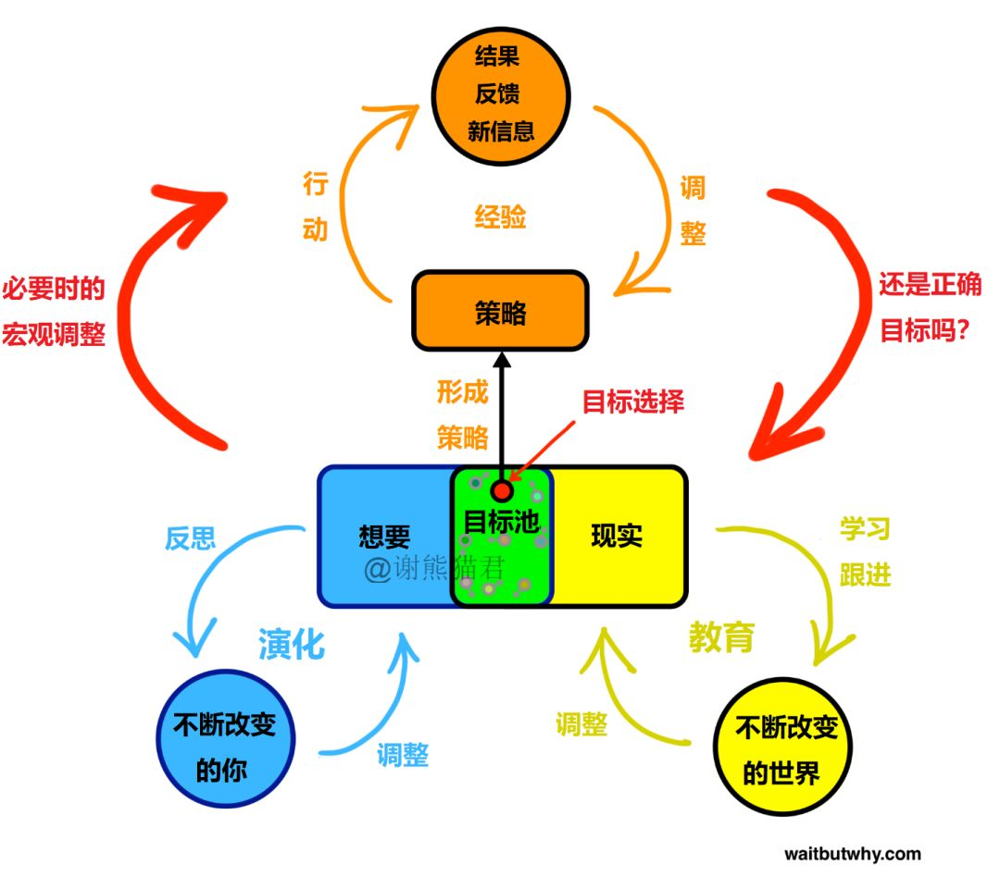

如果职业就像连接很多的点，我们就应该把“睿智的跳点”放在待办事项的前列。最好的开始观察的地方就是你自己的过去。用事后诸葛亮的眼光和积累下来的智慧，学习一下你过去的决策吧，就好像运动员赛后看比赛录像一样。

当我看向我的过去时，我能看到很多的跳点，回顾来看很多是不明智的。但是我能越清晰的看到过去的糟糕决定，以及造成这些糟糕决定的思考模式与行为习惯，我就越不会在未来重复这些错误。

时刻提醒自己你还蛮笨的，也是一个能让人谦卑的做法。谦卑带来的不安感并不好受，不断重写自己生活的地图，也是个沉重的负担。但是不安和困难，是自己为自己做主所带来的感觉。

我们常常在感觉过好的时候，会变得自负，懒于思考，故步自封。所以我们才常常在自以为了解了生活的真谛时，会迷失自我。

最后的话

**开篇**

**深度分析一：想要的职业**

**深度分析二：现实的职业**

**理清未来的头绪**

**最后的话**  

生命的历程中，你的好决定与坏决定会共同铺设你独特的生命路径。我常常告诉读者我们的恐惧会多么的不理性，而这些不理性又会阻止我们前行。但是，对于临终悔恨的恐惧，是我们应该去积极接受的。  

我有幸从来没有经历过临终体验，但是临终的时刻仿佛会让人们更清晰的看待事物。面对死亡，会让你脑中的那些冒名者消失，只剩下你最真实的自己。

我想，临终悔恨，可能就是你最真实的自己，对于那个你从没有获得的生活的一个思考。这部分生活，被别人掩埋到了你的潜意识深处。

我自己的理智是支持这种说法的。回顾我的生命历程，那些让我最苦恼的错误的起因，都是那些别人的想法占据了我的大脑，排挤了我真实的自己。那些错误决定，在当时我就深深的知道，是错的。

**我未来的目标不是避免犯错，而是希望那些我犯的错误，真的是因我而起。**

这就是为什么我写下了这篇严谨的分析，因为我觉得这是为数不多的生命中值得极度严谨对待的话题之一。脑内其它的声音还是会凶狠的争夺你生命的掌控权，但是你必须靠意识最核心处的那个最真实的你，去纠正这一切。

